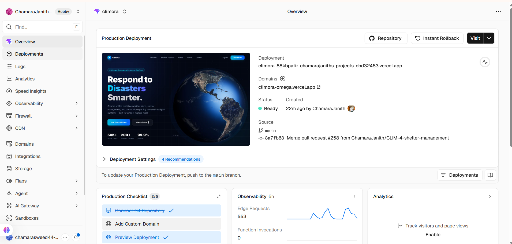
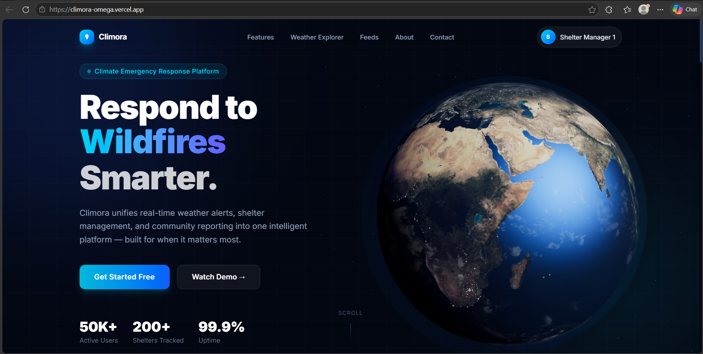

# 🏢 Climora - An Web app to Educate and Prepare users for climate-related emergencies.


## 👥 Group Details

| | Registration Number | Name |
|---|---|---|
| Member 1 | IT23616806 | Abeyrathna T.M.C.J |
| Member 2 | IT23720510 | Dahanayaka G.S.S |
| Member 3 | IT23541702 | Wanasinghe W.A.K.I |
| Member 4 | IT23437470 | Dissanayake D.M.S.S |

**Group ID:** SE-85 | **Batch:** WE.SE.01 | **Module:** SE3040 – Application Frameworks

## 📋 Overview

Climora is a comprehensive disaster relief and climate education platform designed to efficiently manage emergency shelters, educate communities, and provide real-time climate information. The system combines shelter management, relief supply tracking, educational articles with quizzes, emergency checklists, and climate news integration.

> [!NOTE]
> **Language Distribution**: While GitHub may report a high percentage of HTML (approximately 70.7%), this is due to the large number of **automated testing reports and performance results** stored in the repository. The actual project is built entirely using **JavaScript (Node.js/Express)**.

### 🌐 Live Deployment

| Service      | URL                                                                                     |
|--------------|-----------------------------------------------------------------------------------------|
| Backend API  | [https://climora-4aq8.onrender.com](https://climora-4aq8.onrender.com)                  |
| Frontend App | [https://climora-omega.vercel.app](https://climora-omega.vercel.app)                    |

> See [deployment.md](./deployment.md) for the full deployment report including setup steps, environment variables, and evidence screenshots.

---

## 📑 Table of Contents

- [Features](#-features)
- [Live Deployment](#-live-deployment)
- [Quick Start](#-quick-start)
- [Project Structure](#-project-structure)
- [Data Models](#-data-models)
- [API Endpoints](#-api-endpoints)
  - [Shelter Management](#-shelter-crud-operations)
  - [Relief Items](#-relief-items-management)
  - [Shelter Occupancy](#-shelter-occupancy-tracking)
  - [Emergency Alerts](#-emergency-alerts-crud-operations)
  - [Weather API](#-weather-api-integration)
  - [Smart Dashboard](#-smart-dashboard)
  - [Articles](#-article-management)
  - [Quizzes](#-quiz-management)
  - [Checklists](#-emergency-preparedness-checklists)
  - [Climate News](#-climate-news)
  - [Reports](#-incident-reports)
- [Installation & Setup](#-installation--setup)
- [Running the Project](#-running-the-project)
- [Testing](#-testing)
- [Performance Testing](#-performance--load-testing)
- [API Usage Examples](#-api-usage-examples)
- [Error Handling](#-error-handling)
- [Technologies Used](#-technologies-used)

---

## ⭐ Features

### 🏠 Shelter Management

- ✅ Create, read, update, and delete shelter records
- ✅ Track real-time shelter capacity (current vs total)
- ✅ Monitor shelter risk levels (low, medium, high)
- ✅ Support multiple shelter types (school, temple, community hall, other)
- ✅ Store geographic coordinates (latitude/longitude) for mapping
- ✅ Maintain facility information for each shelter
- ✅ Track contact persons and phone numbers

### 📦 Relief Items Management

- ✅ Add and manage relief supplies inventory
- ✅ Track supply categories: food, medicine, water, clothes, hygiene, battery, other
- ✅ Monitor quantities and units (kg, liters, pieces, units)
- ✅ Set and track expiry dates
- ✅ Prioritize items (normal, urgent)
- ✅ Increase/decrease stock levels
- ✅ Remove expired or distributed items

### 🚨 Emergency Alerts

- ✅ Create emergency alerts with auto-generated sequential `alertId` (e.g., `ALERT-00001`)
- ✅ Retrieve all alerts with pagination, filtering, and sorting
- ✅ Retrieve alert by custom `alertId`
- ✅ Update alert details (Admin only)
- ✅ Soft-delete alerts (sets `isActive: false`) (Admin only)
- ✅ Filter alerts by district, severity, category, and active status
- ✅ Personalized alert feed for logged-in user's district
- ✅ Track alert source (MANUAL or OpenWeatherMap)

**Alert Categories:**

- `FLOOD` • `STORM` • `EARTHQUAKE` • `LANDSLIDE` • `TSUNAMI` • `WILDFIRE` • `CYCLONE` • `OTHER`

**Severity Levels:**

- `LOW` • `MEDIUM` • `HIGH` • `CRITICAL`

**Alert Sources:**

- `MANUAL` — Created by admin
- `OpenWeatherMap` — Auto-imported from external weather API

### 🌤️ Weather API Integration

- ✅ Fetch current weather data by coordinates
- ✅ Fetch weather data for logged-in user's saved location
- ✅ Fetch 5-day daily forecast
- ✅ Monitor rainfall, temperature, wind speed, and wind gust
- ✅ Calculate a custom climate risk level with detailed scoring
- ✅ Fetch and auto-save external government weather alerts (OpenWeatherMap One Call 3.0)

#### Risk Calculation Logic

The backend processes live weather data and applies a **cumulative scoring algorithm**:

| Condition                        | Score Added           |
| -------------------------------- | --------------------- |
| Temperature ≥ 38°C               | +2 (Extreme heat)     |
| Temperature ≥ 35°C               | +1 (High temperature) |
| Wind speed ≥ 12 m/s              | +1 (Strong wind)      |
| Wind gust ≥ 20 m/s               | +2 (Severe wind gust) |
| Rain > 10 mm/hr                  | +1 (Heavy rainfall)   |
| External government alert active | +2                    |

**Risk Levels:** `LOW` (≤2) • `MEDIUM` (≤4) • `HIGH` (≤6) • `CRITICAL` (>6)

> This ensures the system does not only display third-party data but also applies backend business logic.

### � Smart Dashboard

- ✅ Combined view of active alerts + real-time weather + calculated risk level
- ✅ Optional district filter for alerts
- ✅ Personalized dashboard that auto-uses logged-in user's saved location and district

### �📍 Location-Based Services

- ✅ Find nearby shelters based on GPS coordinates
- ✅ Calculate distance between user location and shelters
- ✅ Calculate travel time using routing matrix service
- ✅ Sort shelters by proximity and accessibility
- ✅ Support location-based emergency response
- ✅ View shelter distribution across districts

### 📚 Educational Articles & Content

- ✅ Create and manage climate-related articles
- ✅ Support multiple disaster categories (flood, drought, cyclone, landslide, wildfire, tsunami, earthquake)
- ✅ Search articles by title and content
- ✅ Filter articles by category
- ✅ Associate articles with quizzes (one-to-one relationship)
- ✅ Fetch related YouTube videos based on article topic
- ✅ Track article statistics and engagement

**Article Categories:**

- `flood` • `drought` • `cyclone` • `landslide` • `wildfire` • `tsunami` • `earthquake` • `photochemical smog` • `general`

### 🎯 Interactive Quizzes

- ✅ Create quizzes linked to articles
- ✅ Support multiple-choice questions (4 options per question)
- ✅ Track quiz attempts and user scores
- ✅ Define passing score percentage
- ✅ Detailed result analysis with question-by-question feedback
- ✅ One quiz per article enforced
- ✅ Quiz statistics and performance tracking
- ✅ Support 1-20 questions per quiz

### ✅ Emergency Preparedness Checklists

- ✅ Admin creates disaster-specific checklists
- ✅ Define checklist items with categories and quantities
- ✅ Users mark items as completed
- ✅ Track individual progress per user per checklist
- ✅ Progress percentage calculations
- ✅ Support multiple disaster types
- ✅ Reset progress functionality

**Checklist Categories:**

- `food` • `water` • `medicine` • `clothing` • `tools` • `documents` • `other`

**Disaster Types:**

- `flood` • `drought` • `cyclone` • `landslide` • `wildfire` • `tsunami` • `earthquake` • `general`

### 🌍 Climate News Integration

- ✅ Fetch real-time climate and disaster news from NewsData.io API
- ✅ Strict content filtering (removes sports, politics, lifestyle noise)
- ✅ Automatic climate category detection with AI-like pattern matching
- ✅ Sri Lanka-specific news filtering
- ✅ Comprehensive blacklist against false positives
- ✅ 30-minute cache to avoid API rate limits
- ✅ Filter by category and region (Sri Lanka / World)
- ✅ Manual refresh and cleanup operations for admins
- ✅ Never displays sports team names, financial news, or metaphorical usage

**Climate News Categories:**

- `flood` • `drought` • `cyclone` • `earthquake` • `tsunami` • `wildfire` • `storm` • `landslide` • `general`

- ✅ Measure checklist completion progress
- ✅ Generate content engagement statistics
- ✅ Article view and category analytics

### 🔐 User Authentication & RBAC

- ✅ Secure JWT-based authentication
- ✅ Google OAuth 2.0 integration for seamless login
- ✅ Role-Based Access Control (RBAC): `CITIZEN`, `STAFF`, `CONTENT_MANAGER`, `ADMIN`
- ✅ Profile management and custom `userId` generation (e.g., `User-00001`)
- ✅ Session-based security and password hashing (Bcrypt)

### 📢 Community Incident Reporting

- ✅ Crowdsourced reporting for floods, landslides, and storms
- ✅ Multi-photo support with **Cloudinary** cloud storage
- ✅ Automated **Weather Context** fetching for incident validation
- ✅ Verification workflow: `PENDING` ➔ `ADMIN_VERIFIED`
- ✅ Community social engagement: **Upvoting** and **Commenting** on verified reports
- ✅ Sequential ID system for reports and interactions (e.g., `Report-00001`)

---

## 🚀 Quick Start

```bash
# Navigate to backend
cd backend

# Install dependencies
npm install

# Create .env file (see Installation & Setup)
# Then start the server
npm run dev
```

The server will start on `http://localhost:5000`

---

## 📁 Project Structure

```
climora/
├── backend/                              # Express.js REST API
│   ├── models/
│   │   ├── User.js                       # User authentication model
│   │   ├── Shelter.js                    # Shelter and Relief Item schemas
│   │   ├── ShelterCounter.js             # Auto-incrementing, formatted Shelter ID
│   │   ├── ShelterOccupancy.js           # Shelter Occupancy snapshot schema
│   │   ├── ReliefItems.js                # Standalone Relief Items model
│   │   ├── Alert.js                      # Emergency Alert schema
│   │   ├── Article.js                    # Article model with quiz linking
│   │   ├── Quiz.js                       # Quiz model with article reference
│   │   ├── QuizAttempt.js                # User quiz attempt tracking
│   │   ├── Checklist.js                  # Admin-created checklist template
│   │   ├── UserChecklistProgress.js      # User's checklist progress tracking
│   │   ├── ClimateNews.js                # Climate news cache from API
│   │   ├── Report.js                     # Incident Report model (sequential Report-00001)
│   │   ├── ReportComment.js              # Community comments on reports
│   │   ├── Vote.js                       # Up/Down voting records
│   │   └── Counter.js                    # Shared sequential ID counter
│   ├── controller/
│   │   ├── authController.js             # Authentication & user management
│   │   ├── shelterController.js          # Business logic for shelter operations
│   │   ├── reliefItemController.js       # Relief item CRUD & stock logic
│   │   ├── shelterOccupancyController.js # Occupancy snapshots & safety flags
│   │   ├── alertController.js            # Emergency Alert CRUD + personalized alerts
│   │   ├── weatherController.js          # Weather API, risk calculation & external alerts
│   │   ├── dashboardController.js        # Combined alerts + weather + risk dashboard
│   │   ├── articleController.js          # Article CRUD + YouTube integration
│   │   ├── quizController.js             # Quiz CRUD + submission & scoring
│   │   ├── checklistController.js        # Admin checklist management
│   │   ├── userChecklistController.js    # User checklist progress tracking
│   │   ├── climateNewsController.js      # Climate news fetch & filtering
│   │   ├── reportController.js           # Incident report management
│   │   ├── commentController.js          # Report commenting system
│   │   └── voteController.js             # Community voting (UP/DOWN)
│   ├── routes/
│   │   ├── authRoutes.js                 # Authentication & profile routes
│   │   ├── shelterRoutes.js              # Shelter API routes
│   │   ├── alertRoutes.js                # Alert API routes
│   │   ├── weatherRoutes.js              # Weather API routes
│   │   ├── dashboardRoutes.js            # Dashboard API routes
│   │   ├── articleRoutes.js              # Article API routes
│   │   ├── quizRoutes.js                 # Quiz API routes
│   │   ├── checklistRoutes.js            # Checklist API routes
│   │   ├── userChecklistRoutes.js        # User checklist API routes
│   │   ├── climateNewsRoutes.js          # News API routes
│   │   └── reportRoutes.js               # Incident reports & social routes
│   ├── middleware/
│   │   ├── authMiddleware.js             # JWT verification (protect, adminOnly)
│   │   ├── roleMiddleware.js             # Advanced RBAC (allowRoles)
│   │   └── uploadMiddleware.js           # Multer + Cloudinary storage config
│   ├── config/
│   │   ├── db.js                         # MongoDB connection
│   │   └── cloudinary.js                 # Cloudinary media config
│   ├── services/
│   │   ├── weatherService.js             # OpenWeatherMap 3.0 API integration
│   │   ├── routingService.js             # Travel matrix / distance routing service
│   │   └── climateNewsAPI.js             # NewsData.io API integration
│   ├── utils/
│   │   └── getNextSequence.js            # Sequential ID generator utility
│   ├── tests/
│   │   ├── unit/
│   │   │   ├── alertController.test.js
│   │   │   ├── Articlecontroller.test.js
│   │   │   ├── authController.test.js
│   │   │   ├── authMiddleware.test.js
│   │   │   ├── Checklistcontroller.test.js
│   │   │   ├── Climatenewscontroller.test.js
│   │   │   ├── commentController.test.js
│   │   │   ├── dashboardController.test.js
│   │   │   ├── Quizcontroller.test.js
│   │   │   ├── reliefItemController.test.js
│   │   │   ├── reportController.test.js
│   │   │   ├── shelterController.test.js
│   │   │   ├── shelterOccupancyController.test.js
│   │   │   ├── Userchecklistcontroller.test.js
│   │   │   ├── voteController.test.js
│   │   │   ├── weatherController.test.js
│   │   │   └── testUtils/
│   │   │       └── mockExpress.js        # Mock req/res utilities for unit tests
│   │   ├── Integration/
│   │   │   ├── alertRoutes.int.test.js
│   │   │   ├── Articlequizroutes.int.test.js
│   │   │   ├── Checklistroutes.int.test.js
│   │   │   ├── Climatenewsroutes.int.test.js
│   │   │   ├── dashboardRoutes.int.test.js
│   │   │   ├── reliefItems.int.test.js
│   │   │   ├── reports.int.test.js
│   │   │   ├── shelterOccupancy.int.test.js
│   │   │   ├── shelters.int.test.js
│   │   │   └── weatherRoutes.int.test.js
│   │   └── utils/
│   │       └── testApp.js                # Express test app factory
│   ├── artillery-shelters-full.yml       # Shelter routes load test config
│   ├── artillery-alert-weather.yml       # Alerts & Weather load test config
│   ├── artillery-contents-full.yml       # Content routes load test config
│   ├── artillery-reports.yml             # Reports & Social load test config
│   ├── alert-weather-result.json         # Load test results (JSON)
│   ├── alert-weather-result.json.html    # Load test visual report (HTML)
│   ├── contents-result.json              # Content load test results (JSON)
│   ├── contents-result.json.html         # Content load test visual report (HTML)
│   ├── shelters-result.json              # Shelter load test results (JSON)
│   ├── shelters-result.json.html         # Shelter load test visual report (HTML)
│   ├── artillery-reports.json            # Reports load test results (JSON)
│   ├── artillery-reports.json.html       # Reports load test visual report (HTML)
│   ├── server.js                         # Main server entry point
│   ├── jest.config.js                    # Jest configuration
│   └── package.json                      # Backend dependencies and scripts
│
└── frontend/                             # React + Vite frontend application
    ├── src/
    │   ├── assets/
    │   │   └── hero.png                  # Static image assets
    │   ├── components/
    │   │   ├── admin/
    │   │   │   ├── AdminReportCard.jsx   # Report card for admin view
    │   │   │   ├── AdminReportDetail.jsx # Report detail modal for admin
    │   │   │   ├── AlertCard.jsx         # Alert display card
    │   │   │   ├── Sidebar.jsx           # Admin sidebar navigation
    │   │   │   ├── StaffQuickAdd.jsx     # Quick staff creation form
    │   │   │   ├── StatCard.jsx          # Dashboard statistics card
    │   │   │   └── Topbar.jsx            # Admin top navigation bar
    │   │   ├── auth/
    │   │   │   └── GoogleButton.jsx      # Google OAuth sign-in button
    │   │   ├── landing/
    │   │   │   ├── CTASection.jsx        # Call-to-action section
    │   │   │   ├── FeaturesSection.jsx   # Features showcase section
    │   │   │   ├── Footer.jsx            # Site footer
    │   │   │   ├── HeroSection.jsx       # Landing page hero with 3D scene
    │   │   │   ├── Navbar.jsx            # Public navigation bar
    │   │   │   ├── ShowcaseSection.jsx   # Product showcase section
    │   │   │   ├── StatsSection.jsx      # Statistics display section
    │   │   │   └── TestimonialsSection.jsx # User testimonials
    │   │   ├── layout/
    │   │   │   └── AuthLayout.jsx        # Shared layout for auth pages
    │   │   ├── routing/
    │   │   │   └── ProtectedRoute.jsx    # Role-based route guard
    │   │   ├── ui/
    │   │   │   ├── Button.jsx            # Reusable button component
    │   │   │   ├── Input.jsx             # Reusable input component
    │   │   │   └── ProfileLocationMap.jsx # Leaflet map for profile location
    │   │   ├── user/
    │   │   │   ├── DashboardTabs.jsx     # Tab navigation for user dashboard
    │   │   │   ├── ProfileDashboard.jsx  # User profile management panel
    │   │   │   ├── ReportDetailsView.jsx # Detailed report view for users
    │   │   │   ├── UserReportPanel.jsx   # User's submitted reports panel
    │   │   │   └── UserWeatherPanel.jsx  # Personalized weather widget
    │   │   ├── weather/
    │   │   │   ├── AlertsPanel.jsx       # Active alerts display panel
    │   │   │   ├── ForecastList.jsx      # 5-day forecast list
    │   │   │   ├── LocationSearch.jsx    # Nominatim location search input
    │   │   │   ├── RiskCard.jsx          # Climate risk level card
    │   │   │   ├── WeatherHeader.jsx     # Weather page header
    │   │   │   └── WeatherHero.jsx       # Weather hero section
    │   │   └── ShelterScene.jsx          # Three.js 3D shelter scene (landing)
    │   ├── contexts/
    │   │   └── AuthContext.jsx           # Global auth state (Context API)
    │   ├── hooks/
    │   │   └── useWeatherData.js         # Custom hook for weather API calls
    │   ├── layouts/
    │   │   └── AdminLayout.jsx           # Shared layout wrapper for admin pages
    │   ├── pages/
    │   │   ├── admin/
    │   │   │   ├── AdminDashboard.jsx    # Admin overview dashboard
    │   │   │   ├── AdminPlaceholder.jsx  # Placeholder for unbuilt admin pages
    │   │   │   ├── AdminReportsPage.jsx  # Admin report management page
    │   │   │   ├── AlertDetails.jsx      # Single alert detail view
    │   │   │   ├── AlertsPage.jsx        # Alert list with filters & pagination
    │   │   │   ├── CreateAlert.jsx       # Create new alert form
    │   │   │   ├── EditAlert.jsx         # Edit existing alert form
    │   │   │   ├── StaffManagement.jsx   # Staff user management page
    │   │   │   ├── UsersPage.jsx         # All users management page
    │   │   │   └── WeatherPage.jsx       # Admin weather monitoring page
    │   │   ├── auth/
    │   │   │   ├── ForgotPasswordPage.jsx # Forgot password form
    │   │   │   ├── LoginPage.jsx          # Login with email or Google OAuth
    │   │   │   ├── RegisterPage.jsx       # New user registration form
    │   │   │   └── ResetPasswordPage.jsx  # Password reset via token
    │   │   ├── contentManager/
    │   │   │   ├── ArticleDetailPage.jsx  # Single article with quiz & videos
    │   │   │   ├── ArticlesPage.jsx       # Article list with search & filter
    │   │   │   ├── ClimateNewsPage.jsx    # Climate news feed with filters
    │   │   │   └── ContentDashboard.jsx   # Content manager dashboard
    │   │   ├── shelterManager/
    │   │   │   ├── OccupancyPage.jsx      # Shelter occupancy tracking
    │   │   │   ├── ReliefItemsPage.jsx    # Relief items inventory management
    │   │   │   ├── ReportsPage.jsx        # Shelter reports overview
    │   │   │   ├── ShelterAlertsPage.jsx  # Alerts view for shelter manager
    │   │   │   ├── ShelterDashboard.jsx   # Main shelter management dashboard
    │   │   │   ├── ShelterPlaceholder.jsx # Placeholder for unbuilt shelter pages
    │   │   │   └── ShelterStatusPage.jsx  # Shelter status management
    │   │   ├── AboutPage.jsx              # About Climora page
    │   │   ├── ContactPage.jsx            # Contact page
    │   │   ├── FeaturesPage.jsx           # Features overview page
    │   │   ├── LandingPage.jsx            # Public landing page
    │   │   ├── ShowcasePage.jsx           # Product showcase page
    │   │   ├── UnauthorizedPage.jsx       # 403 unauthorized access page
    │   │   └── UserDashboard.jsx          # Citizen user dashboard
    │   ├── services/
    │   │   ├── api.js                     # Axios instance with JWT interceptor
    │   │   ├── auth.js                    # Auth API calls (login, register, etc.)
    │   │   └── socket.js                  # Socket.io client for real-time alerts
    │   ├── utils/
    │   │   ├── formatTimeAgo.js           # Relative time formatter utility
    │   │   └── severityConfig.js          # Severity level color/label config
    │   ├── App.jsx                        # Root component with all routes
    │   ├── App.css                        # Global app styles
    │   ├── index.css                      # Tailwind CSS base styles
    │   └── main.jsx                       # React app entry point
    ├── eslint.config.js                   # ESLint configuration
    ├── vite.config.js                     # Vite build configuration
    └── package.json                       # Frontend dependencies and scripts
```

---

## 📊 Data Models

### 🏠 Shelter Schema

> **Note:** Public identifier is `shelterId` (e.g., `KALUTARA-KL0001`), generated automatically per district.

| Field                   | Type         | Required | Default        | Description                                            |
| ----------------------- | ------------ | -------- | -------------- | ------------------------------------------------------ |
| `shelterId`             | String       | ✅       | Auto-generated | Formatted shelter code (e.g., KALUTARA-KL0001), unique |
| `name`                  | String       | ✅       | -              | Shelter name                                           |
| `description`           | String       | ❌       | -              | Shelter details                                        |
| `address`               | String       | ✅       | -              | Physical address                                       |
| `district`              | String       | ✅       | -              | District location                                      |
| `lat`                   | Number       | ✅       | -              | Latitude coordinate                                    |
| `lng`                   | Number       | ✅       | -              | Longitude coordinate                                   |
| `capacityTotal`         | Number       | ✅       | -              | Maximum capacity                                       |
| `capacityCurrent`       | Number       | ❌       | 0              | Current occupancy                                      |
| `isActive`              | Boolean      | ❌       | true           | Active status                                          |
| `type`                  | String       | ❌       | "other"        | Enum: school, temple, communityHall, other             |
| `riskLevel`             | String       | ❌       | "low"          | Enum: low, medium, high                                |
| `facilities`            | [String]     | ❌       | []             | Available facilities                                   |
| `reliefItems`           | [ReliefItem] | ❌       | []             | Inventory of supplies                                  |
| `contactPerson`         | String       | ❌       | -              | Primary contact name                                   |
| `contactPhone`          | String       | ❌       | -              | Contact phone                                          |
| `contactEmail`          | String       | ❌       | -              | Contact email                                          |
| `currentOccupantsCount` | Number       | ❌       | 0              | Current number of occupants                            |
| `lastUpdatedBy`         | String       | ❌       | -              | Username of last editor                                |
| `status`                | String       | ❌       | "planned"      | Enum: planned, standby, open, closed                   |
| `openSince`             | Date         | ❌       | -              | Date/time when shelter was opened                      |
| `closedAt`              | Date         | ❌       | -              | Date/time when shelter was closed                      |

### 📦 Relief Item Schema (Sub-Document)

| Field           | Type   | Required | Default  | Description                                                   |
| --------------- | ------ | -------- | -------- | ------------------------------------------------------------- |
| `name`          | String | ✅       | -        | Item name                                                     |
| `category`      | String | ❌       | "other"  | Enum: food, medicine, water, clothes, hygiene, battery, other |
| `quantity`      | Number | ❌       | 0        | Current quantity                                              |
| `unit`          | String | ❌       | "units"  | Enum: kg, liters, pieces, units                               |
| `expiryDate`    | Date   | ❌       | -        | Item expiry date                                              |
| `priorityLevel` | String | ❌       | "normal" | Enum: normal, urgent                                          |
| `lastUpdated`   | Date   | ❌       | now      | Last update timestamp                                         |

### 📈 Shelter Occupancy Schema

Tracks occupancy snapshots and over-capacity alerts.

| Field                  | Type    | Required | Default | Description                            |
| ---------------------- | ------- | -------- | ------- | -------------------------------------- |
| `shelterId`            | String  | ✅       | -       | Formatted shelter ID                   |
| `capacityTotal`        | Number  | ✅       | -       | Total capacity at time of record       |
| `currentOccupancy`     | Number  | ✅       | 0       | Number of occupants                    |
| `safeThresholdPercent` | Number  | ❌       | 90      | Percentage threshold for safety alerts |
| `isOverCapacity`       | Boolean | ❌       | false   | Calculated flag based on threshold     |
| `childrenCount`        | Number  | ❌       | 0       | Number of children                     |
| `elderlyCount`         | Number  | ❌       | 0       | Number of elderly persons              |
| `specialNeedsCount`    | Number  | ❌       | 0       | Number of persons with special needs   |
| `recordedAt`           | Date    | ❌       | now     | Timestamp of snapshot                  |
| `recordedBy`           | String  | ❌       | -       | User who recorded the data             |

### �🔢 ShelterCounter Schema

Used internally to generate per-district incremental IDs like `KALUTARA-KL0001`, `BADULLA-BD0001`, etc.

| Field | Type   | Description                                    |
| ----- | ------ | ---------------------------------------------- |
| `key` | String | District-based key (e.g., KALUTARA-KL), unique |
| `seq` | Number | Incrementing sequence for that key             |

### 🚨 Emergency Alert Schema

| Field           | Type    | Required | Default  | Description                                                                            |
| --------------- | ------- | -------- | -------- | -------------------------------------------------------------------------------------- |
| `alertId`       | String  | ✅       | Auto-gen | Sequential formatted ID (e.g., `ALERT-00001`), unique                                  |
| `title`         | String  | ✅       | -        | Alert title                                                                            |
| `description`   | String  | ✅       | -        | Alert description                                                                      |
| `category`      | String  | ✅       | -        | `FLOOD`, `STORM`, `EARTHQUAKE`, `LANDSLIDE`, `TSUNAMI`, `WILDFIRE`, `CYCLONE`, `OTHER` |
| `severity`      | String  | ✅       | -        | `LOW`, `MEDIUM`, `HIGH`, `CRITICAL`                                                    |
| `area.district` | String  | ✅       | -        | District location                                                                      |
| `area.city`     | String  | ❌       | -        | City location                                                                          |
| `startAt`       | Date    | ✅       | -        | Start time of the alert                                                                |
| `endAt`         | Date    | ❌       | null     | End time of the alert                                                                  |
| `isActive`      | Boolean | ❌       | true     | Active status (soft delete sets this to false)                                         |
| `source`        | String  | ❌       | `MANUAL` | Alert origin: `MANUAL` (admin) or `OpenWeatherMap` (auto-imported)                     |
| `createdAt`     | Date    | ❌       | Auto     | Creation timestamp                                                                     |
| `updatedAt`     | Date    | ❌       | Auto     | Last update timestamp                                                                  |

### 📚 Article Schema

| Field           | Type    | Required | Default        | Description                                                                             |
| --------------- | ------- | -------- | -------------- | --------------------------------------------------------------------------------------- |
| `_id`           | String  | ✅       | Auto-generated | Custom ID format: `ART-YYMMDD-random`                                                   |
| `title`         | String  | ✅       | -              | Article title (5-200 characters)                                                        |
| `content`       | String  | ✅       | -              | Article content (min 50 characters)                                                     |
| `category`      | String  | ❌       | "general"      | `flood`, `drought`, `cyclone`, `landslide`, `wildfire`, `tsunami`, `earthquake`, others |
| `author`        | String  | ✅       | -              | Author name                                                                             |
| `publishedDate` | Date    | ❌       | now            | Publication date                                                                        |
| `imageUrl`      | String  | ❌       | -              | Featured image URL                                                                      |
| `isPublished`   | Boolean | ❌       | true           | Published status                                                                        |
| `quizId`        | String  | ❌       | null           | Linked Quiz `_id` (one-to-one)                                                          |
| `createdAt`     | Date    | ❌       | Auto           | Creation timestamp                                                                      |

> **YouTube Integration:** Each article automatically fetches 5 related disaster preparedness videos via the YouTube Data API based on its category.

### 🎯 Quiz Schema

| Field          | Type       | Required | Default | Description                           |
| -------------- | ---------- | -------- | ------- | ------------------------------------- |
| `_id`          | String     | ✅       | Auto    | Custom ID format: `QUZ-YYMMDD-random` |
| `title`        | String     | ✅       | -       | Quiz title (min 5 characters)         |
| `articleId`    | String     | ✅       | -       | Ref to Article (unique)               |
| `questions`    | [Question] | ✅       | -       | Array of 1-20 questions               |
| `passingScore` | Number     | ❌       | 60      | Passing percentage (0-100)            |

**Question Sub-Schema:**

- `question`: String (min 10 chars)
- `options`: Array of exactly 4 strings
- `correctAnswer`: Number (index 0-3)

### 🧪 Quiz Attempt Schema

Tracks user quiz submissions and scores.

| Field        | Type     | Description                                 |
| ------------ | -------- | ------------------------------------------- |
| `_id`        | String   | Custom ID format: ATT-YYMMDD-randomNumber   |
| `userId`     | String   | Reference to user who took the quiz         |
| `quizId`     | String   | Reference to the quiz attempted             |
| `articleId`  | String   | Reference to the article                    |
| `answers`    | [Number] | Array of answer indices provided by user    |
| `score`      | Number   | Number of correct answers                   |
| `percentage` | Number   | Score as percentage (0-100)                 |
| `passed`     | Boolean  | Whether user passed (score >= passingScore) |
| `results`    | [Result] | Detailed question-by-question breakdown     |
| `createdAt`  | Date     | Timestamp of attempt                        |
| `updatedAt`  | Date     | Last update timestamp                       |

### ✅ Checklist Schema (Admin Template)

| Field          | Type    | Required | Default | Description                           |
| -------------- | ------- | -------- | ------- | ------------------------------------- |
| `_id`          | String  | ✅       | Auto    | Custom ID format: `CHL-YYMMDD-random` |
| `title`        | String  | ✅       | -       | Checklist title                       |
| `disasterType` | String  | ❌       | "gen"   | `flood`, `cyclone`, `wildfire`, `etc` |
| `items`        | [Item]  | ❌       | []      | Template items defined by Admin       |
| `isActive`     | Boolean | ❌       | true    | Deactivation (soft delete) flag       |

**Checklist Item Sub-Schema:**

- `_id`: Custom ID (`ITM-YYMMDD-random`)
- `itemName`: String (required)
- `category`: `food`, `water`, `medicine`, `clothing`, `tools`, `documents`, `other`
- `quantity`: Number (min 1)
- `note`: String (optional)

### 👤 User Checklist Progress Schema

Tracks which items users have marked as prepared.

| Field         | Type        | Required | Description                        |
| ------------- | ----------- | -------- | ---------------------------------- |
| `_id`         | String      | ✅       | Custom ID: UCP-YYMMDD-randomNumber |
| `userId`      | String      | ✅       | Reference to user                  |
| `checklistId` | String (FK) | ✅       | Reference to checklist template    |
| `markedItems` | [Marked]    | ❌       | Array of items user has checked    |
| `createdAt`   | Date        | ❌       | Creation timestamp                 |
| `updatedAt`   | Date        | ❌       | Last update timestamp              |

**MarkedItem Sub-Schema:**

| Field       | Type    | Description                 |
| ----------- | ------- | --------------------------- |
| `itemId`    | String  | Reference to checklist item |
| `isChecked` | Boolean | Whether user marked as done |

### 🌍 Climate News Schema

Cache of climate and disaster news from NewsData.io API.

| Field             | Type    | Required | Description                               |
| ----------------- | ------- | -------- | ----------------------------------------- |
| `_id`             | String  | ✅       | Custom ID: NEWS-YYMMDD-randomNumber       |
| `articleId`       | String  | ✅       | Unique API article ID (for deduplication) |
| `title`           | String  | ✅       | Article title                             |
| `description`     | String  | ❌       | Article description                       |
| `content`         | String  | ❌       | Full article content                      |
| `sourceName`      | String  | ❌       | News source/publication name              |
| `sourceUrl`       | String  | ❌       | Source website URL                        |
| `link`            | String  | ✅       | Direct link to original article           |
| `imageUrl`        | String  | ❌       | Featured image URL                        |
| `publishedAt`     | Date    | ✅       | Article publication date                  |
| `country`         | String  | ❌       | Country code or country list              |
| `climateCategory` | String  | ✅       | Categorized disaster type                 |
| `isSriLanka`      | Boolean | ✅       | Is this Sri Lanka-specific news?          |
| `createdAt`       | Date    | ❌       | Cache entry creation time                 |
| `updatedAt`       | Date    | ❌       | Cache update timestamp                    |

### 📢 Incident Report Schema

Crowdsourced incident data with verification workflow.

| Field            | Type   | Required | Default   | Description                                           |
| ---------------- | ------ | -------- | --------- | ----------------------------------------------------- |
| `_id`            | String | ✅       | Auto      | Sequential ID: `Report-00001`                         |
| `userId`         | String | ✅       | -         | Custom ID of the reporter                             |
| `title`          | String | ✅       | -         | Incident title                                        |
| `category`       | String | ✅       | -         | `FLOOD`, `LANDSLIDE`, `STORM`, `AIR_QUALITY`, `OTHER` |
| `severity`       | String | ✅       | -         | `LOW`, `MEDIUM`, `HIGH`, `CRITICAL`                   |
| `location`       | Object | ✅       | -         | `{ district, city, lat, lon }`                        |
| `photos`         | [URL]  | ❌       | []        | Cloudinary image URLs                                 |
| `status`         | String | ✅       | `PENDING` | `COMMUNITY_CONFIRMED`, `ADMIN_VERIFIED`, `REJECTED`   |
| `weatherContext` | Object | ❌       | null      | Automated weather snapshot (Open-Meteo)               |

### 💬 Social Schemas (Comments & Votes)

**ReportComment:**

- `_id`: `Comment-00001`
- `reportId`: Ref to Report
- `userId`: Custom User ID
- `text`: Comment content

**Vote:**

- `_id`: `Vote-00001`
- `voteType`: `UP` or `DOWN` (Unique per user/report)

**Climate Categories:**

- `flood` • `drought` • `cyclone` • `earthquake` • `tsunami` • `wildfire` • `storm` • `landslide` • `general`

### 👤 User Schema

Core profile and authentication data.

| Field      | Type    | Required | Default   | Description                                    |
| ---------- | ------- | -------- | --------- | ---------------------------------------------- |
| `_id`      | Object  | ✅       | Auto      | MongoDB Object ID                              |
| `userId`   | String  | ✅       | Auto      | Custom formatted ID (e.g., `User-00001`)       |
| `username` | String  | ✅       | -         | Unique username                                |
| `email`    | String  | ✅       | -         | Unique email address                           |
| `password` | String  | ✅       | -         | Hashed password (Bcrypt)                       |
| `role`     | String  | ✅       | `CITIZEN` | `CITIZEN`, `STAFF`, `CONTENT_MANAGER`, `ADMIN` |
| `location` | Object  | ✅       | -         | `{ district, city, lat, lon }`                 |
| `isActive` | Boolean | ❌       | `true`    | Account status                                 |
| `googleId` | String  | ❌       | null      | Google OAuth profile ID                        |

### 🔢 Counter Schema

Internal utility to track sequential IDs for different collections.

| Field | Type   | Description                                   |
| ----- | ------ | --------------------------------------------- |
| `id`  | String | Identifier for the counter (e.g., `reportId`) |
| `seq` | Number | Current incremental value                     |

---

## 🔌 API Endpoints

### 🏠 Shelter CRUD Operations

#### Get All Shelters

```http
GET /api/shelters
```

**Response:** Array of all shelter objects

#### Get Shelter by ID

```http
GET /api/shelters/:id
```

**Path Parameter:**

- `:id` - Shelter ID (formatted shelterId, e.g., `KALUTARA-KL0001`)

**Response:** Single shelter object

#### Create New Shelter

```http
POST /api/shelters
Content-Type: application/json
```

**Request Body:**

```json
{
  "name": "Central Relief Camp",
  "description": "Main evacuation center",
  "address": "123 Main Street",
  "district": "Colombo",
  "lat": 6.9271,
  "lng": 80.7789,
  "capacityTotal": 500,
  "type": "communityHall",
  "riskLevel": "low",
  "facilities": ["water", "medical", "food"],
  "contactPerson": "John Doe",
  "contactPhone": "+94112345678",
  "contactEmail": "john@example.com"
}
```

**Response:** Created shelter object with auto-generated `shelterId` (e.g., `COLOMBO-CB0001`)

#### Update Shelter

```http
PUT /api/shelters/:id
Content-Type: application/json
```

**Path Parameter:**

- `:id` - Shelter ID (e.g., `KALUTARA-KL0001`)

**Request Body:** Partial or complete shelter data

**Response:** Updated shelter object

#### Update Shelter Status

```http
PATCH /api/shelters/:id/status
Content-Type: application/json
```

**Path Parameter:**

- `:id` - Shelter ID

**Request Body:**

```json
{
  "status": "open"
}
```

**Allowed Statuses:** `planned` • `standby` • `open` • `closed`

**Response:**

```json
{
  "shelterId": "KALUTARA-KL0001",
  "status": "open",
  "openSince": "2026-02-15T10:30:00Z",
  "closedAt": null
}
```

#### Delete Shelter

```http
DELETE /api/shelters/:id
```

**Path Parameter:**

- `:id` - Shelter ID (e.g., `KALUTARA-KL0001`)

**Response:**

```json
{ "message": "Shelter deleted successfully" }
```

---

### � Shelter Statistics & Location-Based Services

#### Get Shelter Counts by District

```http
GET /api/shelters/counts/by-district
```

**Response:** Statistics showing the number of shelters and their distribution across districts

```json
{
  "KALUTARA": 5,
  "COLOMBO": 12,
  "GALLE": 3,
  "BADULLA": 8
}
```

#### Get Nearby Shelters

```http
GET /api/shelters/nearby?lat=6.9271&lng=79.8612&limit=5
```

**Query Parameters:**

- `lat` - Current latitude (required)
- `lng` - Current longitude (required)
- `limit` - Maximum number of nearby shelters to return (optional, default: 10)

**Response:** Array of nearby shelters sorted by travel time, including distance and duration

```json
[
  {
    "_id": "507f1f77bcf86cd799439011",
    "shelterId": "COLOMBO-CB0001",
    "name": "Central Relief Camp",
    "district": "Colombo",
    "lat": 6.9271,
    "lng": 80.7789,
    "capacityTotal": 500,
    "capacityCurrent": 150,
    "distanceKm": 2500,
    "travelTimeMin": 15.5
  },
  {
    "_id": "507f1f77bcf86cd799439012",
    "shelterId": "COLOMBO-CB0002",
    "name": "Secondary Shelter",
    "district": "Colombo",
    "lat": 6.95,
    "lng": 80.75,
    "capacityTotal": 300,
    "capacityCurrent": 80,
    "distanceKm": 5000,
    "travelTimeMin": 35.0
  }
]
```

> **Note:** Distance is in meters and travel time is calculated using routing service

---

### 📦 Relief Items Management

#### Get All Relief Items

```http
GET /api/shelters/:id/items
```

**Path Parameter:**

- `:id` - Shelter ID

**Response:** Array of all relief items in the shelter

#### Update or Add Relief Item

```http
PUT /api/shelters/:id/items/:itemName
Content-Type: application/json
```

**Path Parameters:**

- `:id` - Shelter ID
- `:itemName` - Item name to update or create

**Request Body:**

```json
{
  "name": "Rice",
  "category": "food",
  "quantity": 100,
  "unit": "kg",
  "priorityLevel": "urgent",
  "expiryDate": "2026-12-31"
}
```

**Response:** Shelter object with updated reliefItems

#### Increase Item Quantity

```http
PUT /api/shelters/:id/items/:itemName/increase
Content-Type: application/json
```

**Path Parameters:**

- `:id` - Shelter ID
- `:itemName` - Item name

**Request Body:**

```json
{
  "amount": 50
}
```

> If `amount` is omitted, default is `1`

**Response:** Updated item object

#### Decrease Item Quantity

```http
PUT /api/shelters/:id/items/:itemName/decrease
Content-Type: application/json
```

**Path Parameters:**

- `:id` - Shelter ID
- `:itemName` - Item name

**Request Body:**

```json
{
  "amount": 20
}
```

> If `amount` is omitted, default is `1`. Quantity will not go below 0.

**Response:** Updated item object

#### Delete Relief Item

```http
DELETE /api/shelters/:id/items/:itemName
```

**Path Parameters:**

- `:id` - Shelter ID
- `:itemName` - Item name to delete

**Response:**

```json
{ "message": "Item removed from shelter" }
```

---

### 📈 Shelter Occupancy Tracking

#### Create Occupancy Snapshot

```http
POST /api/shelters/:id/occupancy
Content-Type: application/json
```

**Request Body:**

```json
{
  "currentOccupancy": 120,
  "childrenCount": 30,
  "elderlyCount": 15,
  "specialNeedsCount": 5,
  "recordedBy": "admin_user"
}
```

#### Get Latest Occupancy

```http
GET /api/shelters/:id/occupancy
```

#### Get Occupancy History

```http
GET /api/shelters/:id/occupancy/history?from=ISO_DATE&to=ISO_DATE
```

#### Quick Update Current Occupancy

```http
PUT /api/shelters/:id/occupancy/current
Content-Type: application/json
```

**Request Body:**

```json
{
  "currentOccupancy": 125
}
```

---

### 🚨 Emergency Alerts CRUD Operations

> **Auth:** All routes require JWT (`protect` middleware). Create / Update / Delete require `ADMIN` role.

#### Get All Alerts (with Pagination & Filtering)

```http
GET /api/alerts
Authorization: Bearer <token>
```

**Query Parameters (all optional):**

| Parameter  | Description                       | Example   |
| ---------- | --------------------------------- | --------- |
| `page`     | Page number (default: 1)          | `1`       |
| `limit`    | Results per page (default: 10)    | `20`      |
| `district` | Filter by district                | `Colombo` |
| `severity` | Filter by severity                | `HIGH`    |
| `category` | Filter by category                | `FLOOD`   |
| `isActive` | Filter by active status           | `true`    |
| `sortBy`   | Sort field (default: `createdAt`) | `startAt` |
| `order`    | Sort order (default: `desc`)      | `asc`     |

**Example:**

```
GET /api/alerts?district=Colombo&severity=HIGH&isActive=true&page=1&limit=10
```

**Response:**

```json
{
  "success": true,
  "pagination": {
    "totalRecords": 42,
    "currentPage": 1,
    "totalPages": 5,
    "pageSize": 10
  },
  "data": [...]
}
```

#### Get My Alerts (Personalized — Logged-In User's District)

```http
GET /api/alerts/my
Authorization: Bearer <token>
```

**Description:** Returns all active alerts for the logged-in user's district (read from `req.user.location.district`).

**Response:**

```json
{
  "success": true,
  "district": "Colombo",
  "totalAlerts": 3,
  "data": [...]
}
```

#### Get Alert by ID

```http
GET /api/alerts/:id
Authorization: Bearer <token>
```

**Path Parameter:**

- `:id` - Custom formatted alertId (e.g., `ALERT-00001`)

**Response:** Single alert object

#### Create New Alert (Admin Only)

```http
POST /api/alerts
Content-Type: application/json
Authorization: Bearer <token>
```

**Request Body:**

```json
{
  "title": "Flood Warning",
  "description": "Heavy rainfall expected in low-lying areas.",
  "category": "FLOOD",
  "severity": "HIGH",
  "area": {
    "district": "Colombo",
    "city": "Kaduwela"
  },
  "startAt": "2026-02-13T04:00:00Z",
  "endAt": "2026-02-14T04:00:00Z"
}
```

**Response:** Created alert object with auto-generated `alertId` (e.g., `ALERT-00001`) and `source: "MANUAL"`

#### Update Alert (Admin Only)

```http
PUT /api/alerts/:id
Content-Type: application/json
Authorization: Bearer <token>
```

**Path Parameter:**

- `:id` - Custom formatted alertId (e.g., `ALERT-00001`)

**Request Body:** Partial or complete alert data

**Response:** Updated alert object

#### Delete Alert / Soft-Deactivate (Admin Only)

```http
DELETE /api/alerts/:id
Authorization: Bearer <token>
```

**Path Parameter:**

- `:id` - Custom formatted alertId (e.g., `ALERT-00001`)

> **Note:** This is a **soft delete** — it sets `isActive: false` rather than permanently removing the record.

**Response:**

```json
{ "success": true, "message": "Alert deactivated successfully" }
```

---

### 🌤️ Weather API Integration

> **Auth:** All weather routes require JWT (`protect` middleware).

#### Get Current Weather

```http
GET /api/weather/current?lat=6.9271&lon=79.8612
Authorization: Bearer <token>
```

**Query Parameters:**

- `lat` - Latitude (required)
- `lon` - Longitude (required)

**Response:**

```json
{
  "success": true,
  "data": {
    "temperature": 31.5,
    "humidity": 78,
    "windSpeed": 4.2,
    "windGust": 7.1,
    "condition": "moderate rain"
  }
}
```

#### Get My Weather (Personalized — Logged-In User's Location)

```http
GET /api/weather/my
Authorization: Bearer <token>
```

**Description:** Returns current weather using the logged-in user's saved `location.lat` / `location.lon`.

**Response:** Same structure as `/current`, plus the `location` object from the user profile.

#### Get Weather Forecast (5-Day Daily)

```http
GET /api/weather/forecast?lat=6.9271&lon=79.8612
Authorization: Bearer <token>
```

**Query Parameters:**

- `lat` - Latitude (required)
- `lon` - Longitude (required)

**Response:**

```json
{
  "success": true,
  "data": [
    {
      "date": "2026-02-27T00:00:00.000Z",
      "minTemp": 24.1,
      "maxTemp": 33.7,
      "humidity": 82,
      "windSpeed": 5.1,
      "condition": "light rain",
      "rainProbability": 60
    }
  ]
}
```

#### Get Calculated Risk Level

```http
GET /api/weather/risk?lat=6.9271&lon=79.8612
Authorization: Bearer <token>
```

**Query Parameters:**

- `lat` - Latitude (required)
- `lon` - Longitude (required)

**Response:**

```json
{
  "success": true,
  "data": {
    "riskLevel": "HIGH",
    "score": 5,
    "reasons": [
      "High temperature",
      "Strong wind",
      "Government weather alert active"
    ],
    "temperature": 36.2,
    "windSpeed": 13.5,
    "rainVolume": 0,
    "externalAlerts": 1
  }
}
```

#### Get External Government Weather Alerts (Auto-Save)

```http
GET /api/weather/external-alerts?lat=6.9271&lon=79.8612
Authorization: Bearer <token>
```

**Query Parameters:**

- `lat` - Latitude (required)
- `lon` - Longitude (required)

**Description:** Fetches active government weather alerts from the OpenWeatherMap One Call 3.0 API. Any new alerts not already in the database are **automatically saved** with `source: "OpenWeatherMap"` and assigned an `EXT-<timestamp>-<random>` ID.

**Response:**

```json
{
  "success": true,
  "count": 1,
  "alerts": [
    {
      "event": "Flash Flood Warning",
      "description": "Heavy rainfall, flooding expected...",
      "start": 1740000000,
      "end": 1740086400
    }
  ]
}
```

---

### 📊 Smart Dashboard

> **Auth:** All dashboard routes require JWT (`protect` middleware). These endpoints combine alerts + live weather + risk calculation into a single response.

#### Get Alerts + Risk (Manual Coordinates)

```http
GET /api/dashboard/alerts-risk?lat=6.9271&lon=79.8612&district=Colombo
Authorization: Bearer <token>
```

**Query Parameters:**

| Parameter  | Description               | Required |
| ---------- | ------------------------- | -------- |
| `lat`      | Latitude                  | ✅       |
| `lon`      | Longitude                 | ✅       |
| `district` | Filter alerts by district | ❌       |

**Response:**

```json
{
  "success": true,
  "data": {
    "alertsCount": 3,
    "externalAlerts": 1,
    "activeAlerts": [...],
    "weather": {
      "temperature": 34.1,
      "humidity": 75,
      "windSpeed": 9.3,
      "condition": "few clouds"
    },
    "riskLevel": "MEDIUM",
    "score": 2
  }
}
```

#### Get My Status (Personalized Dashboard)

```http
GET /api/dashboard/my-status
Authorization: Bearer <token>
```

**Description:** A fully personalized dashboard summary. Uses the logged-in user's saved `location` (lat, lon, district) to automatically fetch:

- Active alerts in the user's district
- Current weather at the user's coordinates
- Calculated risk level

**Response:**

```json
{
  "success": true,
  "location": "Colombo",
  "activeAlertsInMyDistrict": 2,
  "externalAlerts": 0,
  "weather": {
    "temperature": 30.5,
    "humidity": 80,
    "windSpeed": 5.5,
    "condition": "overcast clouds"
  },
  "riskLevel": "LOW",
  "score": 0
}
```

---

### 📚 Article Management

#### Get All Articles

```http
GET /api/articles
```

**Query Parameters:**

- `category` - Filter by category (optional)
- `search` - Search in title and content (optional)
- `page` - Page number (default: 1)
- `limit` - Results per page (default: 20)

**Response:**

```json
{
  "articles": [...],
  "pagination": {
    "page": 1,
    "limit": 20,
    "total": 45,
    "pages": 3
  }
}
```

#### Get Article by ID

```http
GET /api/articles/:id
```

**Response:** Single article with:

- `quiz`: Full linked quiz data (if exists)
- `relatedVideos`: Array of 5 related YouTube videos (fetched via YouTube Data API)
- `hasQuiz` / `hasRelatedVideos`: Helper flags for UI rendering

#### Create Article (Admin/Content Manager)

```http
POST /api/articles
Content-Type: application/json
Authorization: Bearer <token>
```

**Request Body:**

```json
{
  "title": "How to Prepare for Floods",
  "content": "Comprehensive guide on flood preparedness...",
  "category": "flood",
  "author": "Dr. Smith",
  "imageUrl": "https://example.com/image.jpg"
}
```

#### Update Article (Admin/Content Manager)

```http
PUT /api/articles/:id
Content-Type: application/json
Authorization: Bearer <token>
```

**Request Body:** Partial or complete article data

#### Delete Article (Admin/Content Manager)

```http
DELETE /api/articles/:id
Authorization: Bearer <token>
```

#### Get Article Statistics

```http
GET /api/articles/stats
```

**Response:**

```json
{
  "total": 25,
  "withQuiz": 18,
  "withoutQuiz": 7,
  "byCategory": [
    { "category": "flood", "count": 8 },
    { "category": "cyclone", "count": 5 }
  ]
}
```

#### Search YouTube Videos

```http
GET /api/articles/youtube/videos?query=flood+preparedness&maxResults=10
```

**Query Parameters:**

- `query` - Search keyword
- `maxResults` - Number of results (1-50, default: 10)
- `order` - Sort order (relevance, date, viewCount, rating)

---

### 🎯 Quiz Management

#### Get All Quizzes (Admin/Content Manager)

```http
GET /api/quizzes
Authorization: Bearer <token>
```

**Query Parameters:**

- `page` - Page number (default: 1)
- `limit` - Results per page (default: 20)

#### Get Quiz by Article ID

```http
GET /api/quizzes/article/:articleId
```

#### Get Quiz by Quiz ID

```http
GET /api/quizzes/:id
```

#### Create Quiz (Admin/Content Manager)

```http
POST /api/quizzes
Content-Type: application/json
Authorization: Bearer <token>
```

**Request Body:**

```json
{
  "title": "Flood Preparedness Quiz",
  "articleId": "ART-260224-1234",
  "passingScore": 70,
  "questions": [
    {
      "question": "What is the first step in flood preparedness?",
      "options": [
        "Move to high ground",
        "Create an emergency plan",
        "Pack belongings",
        "Stay calm"
      ],
      "correctAnswer": 1
    }
  ]
}
```

#### Update Quiz (Admin/Content Manager)

```http
PUT /api/quizzes/:id
Content-Type: application/json
Authorization: Bearer <token>
```

#### Delete Quiz (Admin/Content Manager)

```http
DELETE /api/quizzes/:id
Authorization: Bearer <token>
```

#### Get Quiz for User (with Attempt History)

```http
GET /api/articles/:articleId/quiz
Authorization: Bearer <token>
```

**Description:** Returns the quiz for a specific article along with the current user's attempt history (from `req.user.userId`).

#### Submit Quiz

```http
POST /api/articles/:articleId/quiz/submit
Authorization: Bearer <token>
```

**Description:** Submits answers, calculates score, and saves a `QuizAttempt` record.

**Request Body:**

```json
{
  "answers": [1, 2, 0, 3]
}
```

**Response:**

```json
{
  "passed": true,
  "percentage": 85,
  "score": 4,
  "total": 5,
  "results": [
    { "questionNumber": 1, "isCorrect": true, "explanation": "✅ Correct!" }
  ],
  "message": "🎉 Congratulations! ..."
}
```

---

### ✅ Emergency Preparedness Checklists

#### Get All Checklists

```http
GET /api/checklists
```

**Response:** Array of available checklists

#### Get Single Checklist

```http
GET /api/checklists/:checklistId
```

#### Create Checklist (Admin/Content Manager)

```http
POST /api/checklists
Content-Type: application/json
Authorization: Bearer <token>
```

**Request Body:**

```json
{
  "title": "Flood Preparedness Checklist",
  "disasterType": "flood",
  "items": [
    {
      "itemName": "Emergency contact list",
      "category": "documents",
      "quantity": 1
    },
    {
      "itemName": "Drinking water",
      "category": "water",
      "quantity": 3
    }
  ]
}
```

#### Add Item to Checklist (Admin/Content Manager)

```http
POST /api/checklists/:checklistId/items
Content-Type: application/json
Authorization: Bearer <token>
```

**Request Body:**

```json
{
  "itemName": "First aid kit",
  "category": "medicine",
  "quantity": 1,
  "note": "Basic first aid supplies"
}
```

#### Update Checklist Item (Admin/Content Manager)

```http
PUT /api/checklists/:checklistId/items/:itemId
Content-Type: application/json
Authorization: Bearer <token>
```

#### Delete Item from Checklist (Admin/Content Manager)

```http
DELETE /api/checklists/:checklistId/items/:itemId
Authorization: Bearer <token>
```

#### Delete Checklist (Admin/Content Manager)

```http
DELETE /api/checklists/:checklistId
Authorization: Bearer <token>
```

---

### 👤 User Checklist Progress

#### Get My Checklist with Progress

```http
GET /api/user-checklists/:checklistId
Authorization: Bearer <token>
```

**Response:**

```json
{
  "checklistId": "CHL-260224-1234",
  "title": "Flood Preparedness Checklist",
  "disasterType": "flood",
  "items": [
    {
      "_id": "ITM-260224-5678",
      "itemName": "Emergency contact list",
      "category": "documents",
      "quantity": 1,
      "note": "",
      "isChecked": true
    }
  ],
  "progress": {
    "total": 10,
    "checked": 7,
    "unchecked": 3,
    "percentage": 70,
    "isComplete": false
  }
}
```

#### Get My Progress Percentage

```http
GET /api/user-checklists/:checklistId/progress
Authorization: Bearer <token>
```

**Response:**

```json
{
  "userId": "user123",
  "checklistId": "CHL-260224-1234",
  "total": 10,
  "checked": 7,
  "unchecked": 3,
  "percentage": 70,
  "isComplete": false
}
```

#### Toggle Checklist Item

```http
PATCH /api/user-checklists/:checklistId/items/:itemId/toggle
Authorization: Bearer <token>
```

**Response:**

```json
{
  "itemId": "ITM-260224-5678",
  "isChecked": true,
  "message": "Item marked as done"
}
```

#### Reset All Checklist Progress

```http
PATCH /api/user-checklists/:checklistId/reset
Authorization: Bearer <token>
```

---

### 🌍 Climate News

#### Get Climate News

```http
GET /api/climate-news?category=flood&type=sri-lanka&page=1&limit=12
```

**Query Parameters:**

- `category` - Filter by climate category (all, flood, cyclone, etc.)
- `type` - News type (all, sri-lanka, world)
- `page` - Page number
- `limit` - Results per page (default: 12)
- `refresh` - Force API refresh (true/false)

**Response:**

```json
{
  "news": [...],
  "pagination": {
    "page": 1,
    "limit": 12,
    "total": 156,
    "pages": 13
  },
  "meta": {
    "type": "sri-lanka",
    "category": "flood",
    "lastUpdated": "2026-02-23T10:30:00Z"
  }
}
```

#### Get Latest Climate News

```http
GET /api/climate-news/latest
```

**Response:** Latest 6 climate news articles

#### Get Climate News Statistics

```http
GET /api/climate-news/stats
```

**Response:**

```json
{
  "total": 256,
  "sriLanka": 145,
  "world": 111,
  "byCategory": [
    { "category": "flood", "count": 67 },
    { "category": "cyclone", "count": 45 }
  ]
}
```

#### Manually Refresh News (Admin)

```http
POST /api/climate-news/refresh
Authorization: Bearer <token>
```

#### Clean Up Irrelevant News (Admin)

```http
DELETE /api/climate-news/cleanup
Authorization: Bearer <token>
```

### 🔐 Authentication & Profile

Routes for user registration, JWT login, and profile management.

| Method | Endpoint                    | Access     | Description                               |
| ------ | --------------------------- | ---------- | ----------------------------------------- |
| `POST` | `/api/auth/register`        | Public     | Register new citizen user                 |
| `POST` | `/api/auth/login`           | Public     | JWT login with custom `userId`            |
| `POST` | `/api/auth/google`          | Public     | Google OAuth integration                  |
| `GET`  | `/api/auth/profile`         | Auth       | Get current user profile                  |
| `GET`  | `/api/auth/profile/:userId` | Admin/Self | View profile by custom ID                 |
| `POST` | `/api/auth/users/staff`     | Admin      | Create `CONTENT_MANAGER` or `STAFF` users |

### 📢 Incident Reporting (Community)

Workflow: Citizen Report (Pending) -> Admin Verification -> Community Engagement.

#### Create Incident Report

```http
POST /api/reports
Authorization: Bearer <token>
Content-Type: multipart/form-data
```

**Features:**

- Up to 5 photos (Auto-uploaded to **Cloudinary**).
- Auto-attaches **Weather Context** (Rain mm, intensity) if category is `FLOOD`.

#### Engagement (Comments & Votes)

- **Voting:** Users can toggle `UP` / `DOWN` on verified reports.
- **Commenting:** Threaded discussions authorized only for `ADMIN_VERIFIED` reports.

| Method  | Endpoint                    | Access | Description                                |
| ------- | --------------------------- | ------ | ------------------------------------------ |
| `GET`   | `/api/reports`              | Public | List only `ADMIN_VERIFIED` reports         |
| `POST`  | `/api/reports/:id/vote`     | Auth   | Toggle confirm/deny vote                   |
| `POST`  | `/api/reports/:id/comments` | Auth   | Add comment to verified report             |
| `PATCH` | `/api/reports/:id/status`   | Admin  | Verify, Reject, or Resolve report          |
| `GET`   | `/api/reports/admin/all`    | Admin  | Dashboard view with any status/date filter |

---

## 🛠️ Installation & Setup

### Prerequisites

- Node.js (v14 or higher)
- npm or yarn
- MongoDB database
- OpenWeather API key (for weather features)
- YouTube Data API key (for related videos feature)
- NewsData.io API key (for climate news feature)

### Setup Steps

#### 1. Navigate to backend folder

```bash
cd backend
```

#### 2. Install dependencies

```bash
npm install
```

#### 3. Create environment variables

Create a `.env` file in the backend directory:

```env
# Database
MONGO_URI=your_mongodb_connection_string
PORT=5000

# Weather API (OpenWeatherMap One Call 3.0)
# Requires a subscribed One Call 3.0 plan for external alerts & forecast
WEATHER_API_KEY=your_openweathermap_api_key
WEATHER_BASE_URL=https://api.openweathermap.org/data/3.0/onecall

# Authentication
JWT_SECRET=your_jwt_secret
JWT_EXPIRES_IN=7d

# OAuth (Optional)
GOOGLE_CLIENT_ID=your_google_client_id
GOOGLE_CLIENT_SECRET=your_google_client_secret

# External APIs (Optional)
YOUTUBE_API_KEY=your_youtube_api_key
NEWSDATA_API_KEY=your_newsdata_api_key

# Cloudinary (Media Uploads)
CLOUDINARY_CLOUD_NAME=your_cloud_name
CLOUDINARY_API_KEY=your_api_key
CLOUDINARY_API_SECRET=your_api_secret
```

**API Key Instructions:**

- **OpenWeather API:** Get free key from [https://openweathermap.org/api](https://openweathermap.org/api)
- **YouTube API:** Enable YouTube Data API v3 in [Google Cloud Console](https://console.cloud.google.com/)
- **NewsData.io API:** Sign up at [https://newsdata.io/](https://newsdata.io/) for free API key
- **Cloudinary:** Register at [https://cloudinary.com/](https://cloudinary.com/) for cloud storage credentials

---

## 🚀 Running the Project

### Development mode (with auto-reload)

```bash
npm run dev
```

### Production mode

```bash
npm start
```

The server will start on `http://localhost:5000` by default.

---

## 🧪 Testing

### Test Framework & Setup

The project uses **Jest** for unit testing with mock fixtures for database and service layers. All database calls and external API services are mocked to ensure tests are isolated and fast.

### Running Tests

#### Run all tests

```bash
npm test
```

#### Run tests with coverage report

```bash
npm test -- --coverage
```

#### Run specific test file

```bash
npm test -- shelterController.test.js
```

#### Run tests in watch mode (auto-rerun on file change)

```bash
npm test -- --watch
```

---

### Unit Tests: Shelter Controller (`shelterController.test.js`)

The shelter controller test suite provides comprehensive coverage for all shelter operations including CRUD operations, relief item management, and location-based services.

#### Test Setup & Mocking

```javascript
// Mocked dependencies
jest.mock("../../models/Shelter"); // Shelter model
jest.mock("../../models/ShelterCounter"); // Counter model
jest.mock("../../services/routingService"); // Routing service
```

**Key Utilities:**

- **Mock Express:** `mockRequest()` and `mockResponse()` from `testUtils/mockExpress.js` provide mock HTTP request/response objects
- **Counter Helper:** `makeCounterLean()` simulates ShelterCounter database increments
- **Isolation:** Jest clears all mocks before each test (`beforeEach`)

---

#### Test Suites

##### 1️⃣ **getAllShelters Tests**

| Test Case                       | Description                        | Expected Result                               |
| ------------------------------- | ---------------------------------- | --------------------------------------------- |
| ✅ Return all shelters with 200 | Fetches all shelters from DB       | Returns array of shelters without status code |
| ❌ Return 500 if error          | Database error occurs during fetch | Returns HTTP 500 with error message           |

**Key Assertions:**

- `Shelter.find()` is called
- Response body contains array of shelter objects
- Error responses include error message

---

##### 2️⃣ **getShelterById Tests**

| Test Case                    | Description                    | Expected Result                                |
| ---------------------------- | ------------------------------ | ---------------------------------------------- |
| ✅ Return shelter when found | Valid shelter ID provided      | Returns shelter object with matching shelterId |
| ❌ Return 404 when not found | Shelter doesn't exist in DB    | HTTP 404 with "Shelter not found" message      |
| ❌ Return 400 on error       | Invalid ID format causes error | HTTP 400 with "Invalid shelter ID" message     |

**Key Assertions:**

- `Shelter.findOne({ shelterId })` is called with correct ID
- Proper HTTP status codes returned (200, 404, 400)
- Error messages are descriptive

---

##### 3️⃣ **createShelter Tests**

| Test Case                         | Description                       | Expected Result                                                |
| --------------------------------- | --------------------------------- | -------------------------------------------------------------- |
| ❌ Return 400 if district missing | Request body lacks district field | HTTP 400 with validation error                                 |
| ✅ Create shelter and return 201  | Valid shelter data provided       | HTTP 201 with auto-generated shelterId (e.g., KALUTARA-KL0001) |
| ❌ Handle create error with 400   | Validation/DB error on create     | HTTP 400 with error message                                    |

**Key Features Tested:**

- Automatic shelter ID generation using district-based counter
- Validation of required fields (district, name, address, etc.)
- Counter increment for unique sequential IDs per district
- Proper error handling for DB failures

**Example Validation:**

```javascript
// Counter is incremented correctly
expect(ShelterCounter.findOneAndUpdate).toHaveBeenCalledWith(
  { key: "KALUTARA-KL" },
  { $inc: { seq: 1 } },
  { new: true, upsert: true },
);

// Generated ID follows format: DISTRICT-CODE0001
expect(Shelter.create).toHaveBeenCalledWith(
  expect.objectContaining({
    shelterId: "KALUTARA-KL0001",
  }),
);
```

---

##### 4️⃣ **updateShelterItem Tests**

| Test Case                          | Description                   | Expected Result                           |
| ---------------------------------- | ----------------------------- | ----------------------------------------- |
| ❌ Return 400 if name missing      | Relief item name not provided | HTTP 400 with validation error            |
| ❌ Return 404 if shelter not found | Shelter doesn't exist         | HTTP 404 with "Shelter not found" message |
| ✅ Update existing item            | Item exists, update quantity  | Item quantity updated and saved           |
| ✅ Add new item when not exists    | Relief item doesn't exist     | New item added to reliefItems array       |
| ❌ Handle error with 400           | Database error occurs         | HTTP 400 with error message               |

**Key Features Tested:**

- Item upsert logic (update or insert)
- Validation of item properties (quantity, unit, category, etc.)
- Proper error handling for missing shelters or validation failures

---

##### 5️⃣ **getNearbyShelters Tests** (Location-Based Service)

| Test Case                                | Description              | Expected Result                                                                  |
| ---------------------------------------- | ------------------------ | -------------------------------------------------------------------------------- |
| ✅ Return shelters sorted by travel time | Valid lat/lng provided   | Array of nearby active shelters with distance & travel time, sorted by proximity |
| ❌ Return 400 if lat/lng missing         | Query params incomplete  | HTTP 400 with parameter requirement error                                        |
| ✅ Return [] when no active shelters     | No active shelters in DB | Empty array response                                                             |

**Key Features Tested:**

- Geographic coordinate validation
- Distance calculation using routing matrix service
- Travel time computation
- Sorting by travel time (nearest first)
- Limit parameter support (default: 10)
- Only active shelters returned

**Example Response:**

```json
[
  {
    "shelterId": "KALUTARA-KL0002",
    "distanceKm": 40000,
    "travelTimeMin": 60.0
  }
]
```

---

### Unit Tests: Relief Item Controller (`reliefItemController.test.js`)

The relief item controller test suite provides comprehensive coverage for all relief supply inventory operations.

#### Test Setup & Mocking

```javascript
// Mocked dependencies
jest.mock("../../models/Shelter"); // Shelter model
```

---

##### 6️⃣ **getShelterItems Tests**

| Test Case                     | Description               | Expected Result                           |
| ----------------------------- | ------------------------- | ----------------------------------------- |
| ✅ Return items for a shelter | Valid shelter ID provided | Returns shelterId, name, district, items  |
| ❌ Return 404 if not found    | Shelter doesn't exist     | HTTP 404 with "Shelter not found" message |
| ❌ Return 500 on error        | Database error occurs     | HTTP 500 with error message               |

**Key Assertions:**

- `Shelter.findOne({ shelterId }).lean()` is called with correct ID
- Response includes `shelterId`, `shelterName`, `district`, and `reliefItems`

---

##### 7️⃣ **updateShelterItem Tests**

| Test Case                          | Description                   | Expected Result                           |
| ---------------------------------- | ----------------------------- | ----------------------------------------- |
| ❌ Return 400 if name missing      | Relief item name not provided | HTTP 400 with "Item name is required"     |
| ❌ Return 404 if shelter not found | Shelter doesn't exist         | HTTP 404 with "Shelter not found" message |
| ✅ Update existing item            | Item exists, update quantity  | Item quantity updated and saved           |
| ✅ Add new item when not exists    | Relief item doesn't exist     | New item added to reliefItems array       |
| ❌ Handle error with 400           | Database error occurs         | HTTP 400 with error message               |

**Key Features Tested:**

- Item upsert logic (update or insert)
- Case-insensitive item name matching
- Validation of item properties (quantity, unit, category)

---

##### 8️⃣ **increaseShelterItem Tests**

| Test Case                            | Description              | Expected Result                           |
| ------------------------------------ | ------------------------ | ----------------------------------------- |
| ❌ Return 400 for invalid amount     | Negative amount provided | HTTP 400 with "amount must be positive"   |
| ❌ Return 404 if shelter not found   | Shelter doesn't exist    | HTTP 404 with "Shelter not found"         |
| ❌ Return 404 if item not found      | Item not in shelter      | HTTP 404 with "Item not found in shelter" |
| ✅ Increase quantity and return item | Valid increase request   | Quantity increased, item returned         |
| ❌ Handle error with 400             | Database error occurs    | HTTP 400 with error message               |

---

##### 9️⃣ **decreaseShelterItem Tests**

| Test Case                            | Description           | Expected Result                           |
| ------------------------------------ | --------------------- | ----------------------------------------- |
| ❌ Return 400 for invalid amount     | Zero/negative amount  | HTTP 400 with "amount must be positive"   |
| ❌ Return 404 if shelter not found   | Shelter doesn't exist | HTTP 404 with "Shelter not found"         |
| ❌ Return 404 if item not found      | Item not in shelter   | HTTP 404 with "Item not found in shelter" |
| ✅ Decrease quantity but not below 0 | Amount exceeds stock  | Quantity floors at 0, never goes negative |
| ❌ Handle error with 400             | Database error occurs | HTTP 400 with error message               |

---

##### 🔟 **deleteShelterItem Tests**

| Test Case                          | Description           | Expected Result                           |
| ---------------------------------- | --------------------- | ----------------------------------------- |
| ❌ Return 404 if shelter not found | Shelter doesn't exist | HTTP 404 with "Shelter not found"         |
| ❌ Return 404 if item not found    | Item not in shelter   | HTTP 404 with "Item not found in shelter" |
| ✅ Delete item and return success  | Valid delete request  | Item removed, success message returned    |
| ❌ Handle error with 400           | Database error occurs | HTTP 400 with error message               |

---

### Unit Tests: Shelter Occupancy Controller (`shelterOccupancyController.test.js`)

The shelter occupancy controller test suite covers occupancy snapshot creation, retrieval, history filtering, and safety flag calculations.

#### Test Setup & Mocking

```javascript
// Mocked dependencies
jest.mock("../../models/Shelter"); // Shelter model
jest.mock("../../models/ShelterOccupancy"); // Occupancy model
```

---

##### 1️⃣1️⃣ **createShelterOccupancy Tests**

| Test Case                          | Description                   | Expected Result                           |
| ---------------------------------- | ----------------------------- | ----------------------------------------- |
| ❌ Return 404 if shelter not found | Shelter doesn't exist         | HTTP 404 with "Shelter not found" message |
| ✅ Create snapshot and return 201  | Valid occupancy data provided | HTTP 201 with snapshot created message    |
| ❌ Handle error with 400           | Database error on creation    | HTTP 400 with error message               |

**Key Features Tested:**

- Safety flag calculation (`isOverCapacity`) via `applyOccupancySafetyFlags()`
- Validation that shelter exists before creating occupancy
- Proper persistence of demographic breakdowns (children, elderly, special needs)

---

##### 1️⃣2️⃣ **getLatestShelterOccupancy Tests**

| Test Case                     | Description                 | Expected Result                       |
| ----------------------------- | --------------------------- | ------------------------------------- |
| ❌ Return 404 if no occupancy | No snapshots exist          | HTTP 404 with "No occupancy data"     |
| ✅ Return latest occupancy    | Snapshots exist for shelter | Returns most recent snapshot (sorted) |
| ❌ Handle error with 400      | Database error occurs       | HTTP 400 with error message           |

---

##### 1️⃣3️⃣ **getShelterOccupancyHistory Tests**

| Test Case                         | Description              | Expected Result                              |
| --------------------------------- | ------------------------ | -------------------------------------------- |
| ✅ Return history without filters | No date filters provided | Returns all history for shelter              |
| ✅ Apply from/to filters          | Date range query params  | Filters history within `from` and `to` dates |
| ❌ Handle error with 400          | Database error occurs    | HTTP 400 with error message                  |

---

##### 1️⃣4️⃣ **updateCurrentOccupancy Tests**

| Test Case                                 | Description                 | Expected Result                               |
| ----------------------------------------- | --------------------------- | --------------------------------------------- |
| ❌ Return 400 if currentOccupancy missing | Required field missing      | HTTP 400 with "currentOccupancy is required"  |
| ❌ Return 404 if shelter not found        | Shelter doesn't exist       | HTTP 404 with "Shelter not found"             |
| ✅ Create new snapshot when none exists   | First occupancy for shelter | New snapshot created with safety flags        |
| ✅ Update existing snapshot               | Previous snapshot exists    | Existing snapshot updated, flags recalculated |
| ❌ Handle error with 400                  | Database error occurs       | HTTP 400 with error message                   |

**Key Features Tested:**

- Automatic `isOverCapacity` flag calculation
- Warning logs at 80%+ capacity, critical logs at 100%+
- Occupancy percentage calculation in response
- Fallback creation when no previous snapshot exists

---

### Unit Tests: Alert Controller (`alertController.test.js`)

The alert controller test suite covers emergency alert management including CRUD operations, pagination, filtering, soft-delete, personalized feeds, and sequential ID generation.

#### Test Setup & Mocking

```javascript
// Mocked dependencies
jest.mock("../../models/Alert"); // Alert model
```

---

##### 1️⃣5️⃣ **createAlert Tests**

| Test Case                                   | Description                                       | Expected Result                                                    |
| ------------------------------------------- | ------------------------------------------------- | ------------------------------------------------------------------ |
| ❌ Return 400 if required fields missing    | `title`, `category`, `area.district`, etc. absent | HTTP 400 with "Missing required fields"                            |
| ✅ Create alert with auto-generated alertId | Valid body provided                               | HTTP 201, `alertId` formatted as `ALERT-00001`, `source: "MANUAL"` |
| ✅ Increment alertId from last alert        | Existing alert found with `alertId`               | Next sequential ID computed correctly (e.g., `ALERT-00002`)        |
| ❌ Handle DB error with 500                 | Database `create()` throws                        | HTTP 500 with "Failed to create alert"                             |

**Key Features Tested:**

- Sequential `alertId` generation (`ALERT-00001`, `ALERT-00002`, …)
- `source` defaulting to `"MANUAL"` on admin creation
- Required field validation before DB interaction

---

##### 1️⃣6️⃣ **getAlerts Tests** (Pagination & Filtering)

| Test Case                                | Description                     | Expected Result                                         |
| ---------------------------------------- | ------------------------------- | ------------------------------------------------------- |
| ✅ Return paginated alerts with metadata | Default page/limit used         | `pagination` object + `data` array returned             |
| ✅ Filter alerts by district             | `district` query param provided | Only matching district alerts returned                  |
| ✅ Filter alerts by severity             | `severity=HIGH` supplied        | Only HIGH severity alerts returned                      |
| ✅ Filter alerts by `isActive`           | `isActive=true` param           | Only active alerts returned                             |
| ✅ Sort alerts by custom field and order | `sortBy=startAt&order=asc`      | Results sorted ascending by `startAt`                   |
| ❌ Return 400 for invalid page/limit     | `page=0` or `limit=-1`          | HTTP 400 with "Page and limit must be positive numbers" |
| ❌ Handle DB error with 500              | Database error on find          | HTTP 500 with "Failed to fetch alerts"                  |

**Key Assertions:**

- `pagination.totalRecords`, `currentPage`, `totalPages`, and `pageSize` all present
- `Alert.find()` called with correctly constructed filter object

---

##### 1️⃣7️⃣ **getAlertById Tests**

| Test Case                    | Description                           | Expected Result                         |
| ---------------------------- | ------------------------------------- | --------------------------------------- |
| ✅ Return alert when found   | Valid `alertId` (e.g., `ALERT-00001`) | Single alert object returned            |
| ❌ Return 404 when not found | Alert doesn't exist in DB             | HTTP 404 with "Alert not found"         |
| ❌ Return 400 on invalid ID  | Malformed ID causes error             | HTTP 400 with "Invalid alert ID format" |

**Key Assertions:**

- `Alert.findOne({ alertId: req.params.id })` called with correct ID
- Not MongoDB `_id` — uses the custom `alertId` string

---

##### 1️⃣8️⃣ **updateAlert & deleteAlert Tests** (Admin Actions)

| Test Case                                  | Description         | Expected Result                                     |
| ------------------------------------------ | ------------------- | --------------------------------------------------- |
| ✅ Update alert and return updated doc     | Valid update body   | Updated alert object returned                       |
| ❌ Return 404 if alert not found on update | Alert doesn't exist | HTTP 404 with "Alert not found"                     |
| ❌ Return 400 on validation failure        | Invalid field value | HTTP 400 with "Failed to update alert"              |
| ✅ Soft-delete alert (set isActive=false)  | Valid alertId       | `isActive` set to `false`, success message returned |
| ❌ Return 404 if alert not found on delete | Alert doesn't exist | HTTP 404 with "Alert not found"                     |

**Key Feature — Soft Delete:**

> `deleteAlert` does **not** remove the document. It calls `findOneAndUpdate` with `{ isActive: false }`.

---

##### 1️⃣9️⃣ **getMyAlerts Tests** (Personalized)

| Test Case                                   | Description                         | Expected Result                                     |
| ------------------------------------------- | ----------------------------------- | --------------------------------------------------- |
| ❌ Return 400 if user has no location       | `req.user.location.district` absent | HTTP 400 with "User location not configured"        |
| ✅ Return active alerts for user's district | User has `location.district` set    | Only active alerts for that district returned       |
| ❌ Handle DB error with 500                 | Database error on find              | HTTP 500 with "Failed to fetch personalized alerts" |

**Key Assertions:**

- Reads `req.user.location.district` (set by `protect` middleware)
- `Alert.find({ "area.district": district, isActive: true })` is called
- Response includes `district`, `totalAlerts`, and `data`

---

### Unit Tests: Weather Controller (`weatherController.test.js`)

The weather controller test suite covers current weather, personalized weather, 5-day forecast, risk level calculation, and external alert auto-save.

#### Test Setup & Mocking

```javascript
// Mocked dependencies
jest.mock("../../services/weatherService"); // weatherService.getOneCallData
jest.mock("../../models/Alert"); // Alert model (for external alert save)
```

---

##### 2️⃣0️⃣ **getCurrentWeather & getMyWeather Tests**

| Test Case                                     | Description                            | Expected Result                                                 |
| --------------------------------------------- | -------------------------------------- | --------------------------------------------------------------- |
| ❌ Return 400 if lat/lon missing (`/current`) | Query params absent                    | HTTP 400 with "Latitude and Longitude are required"             |
| ✅ Return weather data for coordinates        | Valid lat/lon provided                 | `temperature`, `humidity`, `windSpeed`, `windGust`, `condition` |
| ❌ Return 500 if weather service fails        | `getOneCallData` throws                | HTTP 500 with "Failed to fetch weather data"                    |
| ❌ Return 400 if user has no location (`/my`) | `req.user.location` absent             | HTTP 400 with "User location not configured"                    |
| ✅ Return weather using user's saved location | User has `location.lat`/`location.lon` | Same weather structure, includes `location` object              |

---

##### 2️⃣1️⃣ **getForecast Tests**

| Test Case                                  | Description                            | Expected Result                                                                                                          |
| ------------------------------------------ | -------------------------------------- | ------------------------------------------------------------------------------------------------------------------------ |
| ❌ Return 400 if lat/lon missing           | Query params absent                    | HTTP 400 with "Latitude and Longitude are required"                                                                      |
| ✅ Return 5-day forecast array             | Valid lat/lon + `daily` data available | Array of 5 daily objects each with `date`, `minTemp`, `maxTemp`, `humidity`, `windSpeed`, `condition`, `rainProbability` |
| ❌ Return 500 if forecast data unavailable | `data.daily` missing                   | HTTP 500 with "Forecast data not available"                                                                              |

---

##### 2️⃣2️⃣ **getRiskLevel Tests**

| Test Case                                 | Description                                 | Expected Result                                     |
| ----------------------------------------- | ------------------------------------------- | --------------------------------------------------- |
| ❌ Return 400 if lat/lon missing          | Query params absent                         | HTTP 400 with "Latitude and Longitude are required" |
| ✅ Calculate LOW risk (normal conditions) | `temp=25`, `wind=5`, no rain, no alerts     | `riskLevel: "LOW"`, `score: 0`, `reasons: []`       |
| ✅ Calculate MEDIUM risk                  | `temp=36` (high temp) + moderate wind       | `score` in range (1–2), `riskLevel: "MEDIUM"`       |
| ✅ Calculate HIGH risk                    | High temp + wind gust ≥ 20 + external alert | `score` in range (3–4), `riskLevel: "HIGH"`         |
| ✅ Calculate CRITICAL risk                | Multiple severe conditions                  | `score` > 6, `riskLevel: "CRITICAL"`                |
| ✅ Include reasons list in response       | Conditions triggered                        | `reasons` array lists triggered conditions          |
| ❌ Return 500 if weather service fails    | `getOneCallData` throws                     | HTTP 500 with "Failed to calculate risk level"      |

**Key Scoring Logic Tested:**

| Condition             | Score |
| --------------------- | ----- |
| temp ≥ 38°C           | +2    |
| temp ≥ 35°C           | +1    |
| wind_speed ≥ 12       | +1    |
| wind_gust ≥ 20        | +2    |
| rainVolume > 10       | +1    |
| `data.alerts` present | +2    |

---

##### 2️⃣3️⃣ **getExternalWeatherAlerts Tests**

| Test Case                                | Description                                | Expected Result                                                        |
| ---------------------------------------- | ------------------------------------------ | ---------------------------------------------------------------------- |
| ❌ Return 400 if lat/lon missing         | Query params absent                        | HTTP 400 with "Latitude and Longitude are required"                    |
| ✅ Return empty alerts when none present | `data.alerts` is empty                     | `{ count: 0, alerts: [] }`                                             |
| ✅ Auto-save new external alerts to DB   | New government alert returned by API       | `Alert.create()` called with `source: "OpenWeatherMap"` and `EXT-*` ID |
| ✅ Skip duplicate external alerts        | Alert with same `title` + `startAt` exists | `Alert.create()` NOT called again (dedup check)                        |
| ❌ Return 500 if weather service fails   | `getOneCallData` throws                    | HTTP 500 with "Failed to fetch external alerts"                        |

**Key Feature Tested — Auto-Save:**

- Checks `Alert.findOne({ title: ext.event, startAt })` before saving
- New alerts get an `EXT-<timestamp>-<random>` alertId
- `source` set to `"OpenWeatherMap"`, `category` defaults to `"STORM"`

---

### Unit Tests: Dashboard Controller (`dashboardController.test.js`)

The dashboard controller test suite covers the combined alerts + weather + risk summary, both for manual coordinates and for personalized (user location) requests.

#### Test Setup & Mocking

```javascript
// Mocked dependencies
jest.mock("../../models/Alert"); // Alert model
jest.mock("../../services/weatherService"); // weatherService.getOneCallData
```

---

##### 2️⃣4️⃣ **getAlertsAndRisk Tests** (Manual Coordinates)

| Test Case                                 | Description                           | Expected Result                                                |
| ----------------------------------------- | ------------------------------------- | -------------------------------------------------------------- |
| ❌ Return 400 if lat/lon missing          | Query params absent                   | HTTP 400 with "Latitude and Longitude are required"            |
| ✅ Return full dashboard data             | Valid lat/lon, active alerts in DB    | `alertsCount`, `activeAlerts`, `weather`, `riskLevel`, `score` |
| ✅ Filter alerts by optional district     | `district` query param provided       | Only alerts in that district counted                           |
| ✅ Calculate LOW risk                     | Normal weather conditions             | `riskLevel: "LOW"`                                             |
| ✅ Calculate MEDIUM risk                  | One elevated condition (temp ≥ 35)    | `riskLevel: "MEDIUM"`, `score: 1`                              |
| ✅ Calculate HIGH risk                    | Two elevated conditions               | `riskLevel: "HIGH"`, `score: 2`                                |
| ✅ Calculate CRITICAL risk                | External alert present + bad weather  | `riskLevel: "CRITICAL"`, `score ≥ 3`                           |
| ❌ Return 500 if weather data unavailable | `getOneCallData` returns no `current` | HTTP 500 with "Weather data not available"                     |
| ❌ Return 500 on DB/service error         | Exception thrown                      | HTTP 500 with "Failed to generate dashboard data"              |

---

##### 2️⃣5️⃣ **getMyStatus Tests** (Personalized Dashboard)

| Test Case                                 | Description                              | Expected Result                                                           |
| ----------------------------------------- | ---------------------------------------- | ------------------------------------------------------------------------- |
| ❌ Return 400 if user has no location     | `req.user.location.lat` or `.lon` absent | HTTP 400 with "User location not configured"                              |
| ✅ Return personalized dashboard          | User has lat/lon/district saved          | `location` (district), `activeAlertsInMyDistrict`, `weather`, `riskLevel` |
| ✅ Auto-filter alerts to user's district  | User location has `district`             | `Alert.find({ "area.district": district, isActive: true })` called        |
| ✅ Use user's lat/lon for weather         | User has `location.lat` / `location.lon` | `weatherService.getOneCallData(lat, lon)` called with user coords         |
| ❌ Return 500 if weather data unavailable | Weather service returns no `current`     | HTTP 500 with "Weather data not available"                                |
| ❌ Return 500 on DB/service error         | Exception thrown                         | HTTP 500 with "Failed to load personalized dashboard"                     |

**Key Difference from `getAlertsAndRisk`:**

- No query params needed — all inputs come from `req.user.location`
- Response uses `activeAlertsInMyDistrict` instead of `alertsCount`
- `location` field returns the district name string

---

### Unit Tests: Article Controller (`articleController.test.js`)

#### Test Setup & Mocking

```javascript
jest.mock("../../models/Article");
jest.mock("../../models/Quiz");
jest.mock("axios"); // For YouTube API calls
```

##### 2️⃣6️⃣ **getAllArticles Tests**

- ✅ Filter by `category` and `search` (case-insensitive regex)
- ✅ Pagination: Correct `skip` calculation and `totalPages` metadata
- ❌ Handle DB error with 500

##### 2️⃣7️⃣ **getArticleById Tests**

- ✅ Return article + associated `quiz` + 5 `relatedVideos` from YouTube
- ✅ Graceful failure: If YouTube API fails, still returns article and quiz
- ❌ Return 404 for non-existent ID

##### 2️⃣8️⃣ **Admin CRUD Tests**

- ✅ `createArticle`: Validate required fields before saving
- ✅ `updateArticle`: Partial update using `findByIdAndUpdate`
- ✅ `deleteArticle`: **Cascade Delete** — Automatically deletes linked quiz first

---

### Unit Tests: Quiz Controller (`quizController.test.js`)

##### 2️⃣9️⃣ **Quiz Management Tests**

- ✅ `createQuiz`: Enforce one-to-one (fails if Article already has a `quizId`)
- ✅ `submitQuizForUser`:
  - Validates answer array length against question count
  - Correctly identifies right/wrong answers and calculates percentage
  - Stores `QuizAttempt` and returns detailed breakdown per question

##### 3️⃣0️⃣ **User Retrieval Tests**

- ✅ `getQuizForUser`: Returns quiz data plus all previous attempt history

---

### Unit Tests: Checklist Controller (`checklistController.test.js`)

##### 3️⃣1️⃣ **Admin Template Tests**

- ✅ `createChecklist`: Sets `createdBy` and default `disasterType`
- ✅ `adminAddItem`: Appends to `items` sub-document array
- ✅ `deleteChecklist`: **Soft Delete** — sets `isActive: false`

##### 3️⃣2️⃣ **User Progress Tests** (`userChecklistController.test.js`)

- ✅ `getMyChecklist`: Auto-creates `UserChecklistProgress` record if first time accessing
- ✅ `toggleItem`: Flip `isChecked` flag and returns message
- ✅ `getProgress`: Calculates completion percentage dynamically

---

### Unit Tests: Climate News Controller (`climateNewsController.test.js`)

##### 3️⃣3️⃣ **Filtering Logic (Strict Calibration)**

- ✅ `BLACKLIST_PATTERNS`: Rejects sports teams (Cyclones/Thunder) and metaphors
- ✅ `CLIMATE_TITLE_PATTERNS`: Accurately categorizes into flood/cyclone/etc.
- ✅ `isActuallySriLanka`: Rejects syndicated world news with 5+ countries listed

##### 3️⃣4️⃣ **Cache & API Refresh**

- ✅ `getClimateNews`: Returns from DB if cache < 30 mins old
- ✅ `manualRefresh`: Triggers new fetch from `NewsData.io` (Admin only)
- ✅ `cleanupIrrelevantNews`: Bulk re-evaluates and removes non-climate articles

### Unit Tests: Auth Controller (`authController.test.js`)

##### 3️⃣5️⃣ **User Authentication Tests**

- ✅ `register`: Prevents duplicate emails and hashes passwords correctly
- ✅ `login`: Validates credentials and returns JWT + user data
- ✅ `googleLogin`: Processes Google ID tokens and handles auto-registration
- ✅ `createStaffUser`: Restricts staff creation to `ADMIN` only

---

### Unit Tests: Incident & Social Controllers

##### 3️⃣6️⃣ **Report Controller (`reportController.test.js`)**

- ✅ `createReport`:
  - Auto-uploads files to Cloudinary mock
  - Correctly fetches weather snapshot from `weatherService`
  - Validates category/severity enums
- ✅ `updateReport`: Prevents owners from editing once report is no longer `PENDING`
- ✅ `getReports`: Filters out all non-verified reports for the public feed

##### 3️⃣7️⃣ **Vote & Comment Controllers**

- ✅ `voteReport`:
  - Toggles UP/DOWN votes (creates, switch, or remove)
  - Updates `confirmCount`/`denyCount` atomically in Report model
  - ❌ Denies voting on unverified reports
- ✅ `deleteComment`: Allows deletion only by Comment Author or Admin

---

### Integration Tests

Integration tests verify full HTTP request-response flows through Express routes using **Supertest**. Auth and role middleware are mocked to focus on controller + route integration.

#### Test App Factory (`tests/utils/testApp.js`)

```javascript
// Creates a lightweight Express app mounting shelterRoutes
const { createTestApp } = require("../utils/testApp");
let app;
beforeAll(() => {
  app = createTestApp();
});
```

---

#### Integration: Shelter Routes (`shelters.int.test.js`)

| Test Suite                            | Test Case                                   | Expected Result                                     |
| ------------------------------------- | ------------------------------------------- | --------------------------------------------------- |
| `GET /api/shelters/countsby-district` | ✅ Returns 200 and an array when successful | Aggregated district counts returned                 |
| `GET /api/shelters/countsby-district` | ❌ Returns error on DB failure              | HTTP 400/500 with error object                      |
| `GET /api/shelters/nearby`            | ✅ Returns nearby shelters sorted by time   | Array sorted by `travelTimeMin` with distance data  |
| `GET /api/shelters/nearby`            | ❌ Returns 400 if lat/lng missing           | HTTP 400 with parameter requirement error           |
| `PUT /api/shelters/:id/status`        | ✅ Updates status and returns data          | Status changed, timestamps set (openSince/closedAt) |
| `PUT /api/shelters/:id/status`        | ❌ Returns 400 for invalid status           | HTTP 400 with "Invalid status value"                |

---

#### Integration: Relief Item Routes (`reliefItems.int.test.js`)

| Test Suite                                       | Test Case                              | Expected Result                        |
| ------------------------------------------------ | -------------------------------------- | -------------------------------------- |
| `GET /api/shelters/:id/items`                    | ✅ Returns items for a shelter         | Items array with shelter metadata      |
| `GET /api/shelters/:id/items`                    | ❌ Returns 404 if shelter not found    | HTTP 404 with "Shelter not found"      |
| `PUT /api/shelters/:id/items/:itemName`          | ✅ Adds new item when not exists       | Item added to reliefItems, saved       |
| `PUT /api/shelters/:id/items/:itemName`          | ✅ Updates existing item               | Quantity updated in-place              |
| `PUT /api/shelters/:id/items/:itemName/increase` | ✅ Increases quantity and returns item | Quantity incremented correctly         |
| `PUT /api/shelters/:id/items/:itemName/decrease` | ✅ Decreases quantity but not below 0  | Quantity floors at 0                   |
| `DELETE /api/shelters/:id/items/:itemName`       | ✅ Removes item from shelter           | Item deleted, success message returned |

---

#### Integration: Shelter Occupancy Routes (`shelterOccupancy.int.test.js`)

| Test Suite                                | Test Case                                     | Expected Result                                |
| ----------------------------------------- | --------------------------------------------- | ---------------------------------------------- |
| `POST /api/shelters/:id/occupancy`        | ✅ Creates snapshot via route and returns 201 | Snapshot persisted with safety flags           |
| `GET /api/shelters/:id/occupancy`         | ✅ Returns latest occupancy via route         | Most recent snapshot returned                  |
| `PUT /api/shelters/:id/occupancy/current` | ✅ Updates current occupancy via route        | Occupancy updated, `isOverCapacity` calculated |

---

### Test Utilities

#### Mock Express Module (`testUtils/mockExpress.js`)

Provides helper functions to create mock Express request/response objects for testing:

```javascript
// Example usage
const mockReq = mockRequest(body, params, query);
const mockRes = mockResponse();

// Mock functions track calls
mockRes.status(400).json({ error: "message" });
expect(mockRes.status).toHaveBeenCalledWith(400);
expect(mockRes.json).toHaveBeenCalledWith({ error: "message" });
```

---

### Test Configuration (`jest.config.js`)

```javascript
module.exports = {
  testEnvironment: "node",
  testMatch: [
    "**/tests/unit/**/*.test.js",
    "**/tests/integration/**/*.int.test.js",
  ],
};
```

> Tests are configured to match both `*.test.js` files in `tests/unit/` and `*.int.test.js` files in `tests/integration/`.

---

### Coverage Goals

| Category   | Target |
| ---------- | ------ |
| Statements | > 80%  |
| Branches   | > 75%  |
| Functions  | > 80%  |
| Lines      | > 80%  |

---

## 🚀 Performance / Load Testing

The project includes **Artillery** load testing configurations to validate shelter-related, alert/weather, educational content, and community incident reporting API performance under stress.

### Tool: Artillery

[Artillery](https://www.artillery.io/) is a modern, powerful load testing toolkit. It is used here to simulate concurrent users hitting all shelter-related endpoints.

### Configuration 1: `artillery-shelters-full.yml`

```yaml
config:
  target: "http://localhost:5000"
  phases:
    - duration: 60
      arrivalRate: 5
      name: "Warm up"
    - duration: 120
      arrivalRate: 15
      name: "Peak load"
```

### Configuration 2: `artillery-alert-weather.yml`

```yaml
config:
  target: "http://localhost:5000"
  phases:
    - duration: 60
      arrivalRate: 5
      name: "Warm up"
    - duration: 120
      arrivalRate: 20
      name: "Peak load"
    - duration: 60
      arrivalRate: 40
      name: "Stress spike"
```

### Configuration 3: `artillery-contents-full.yml`

```yaml
config:
  target: "http://localhost:5000"
  phases:
    - duration: 60
      arrivalRate: 5
      name: "Warm up"
    - duration: 120
      arrivalRate: 15
      name: "Peak load"
```

### Configuration 4: `artillery-reports.yml`

```yaml
config:
  target: "http://localhost:5000"
  phases:
    - duration: 60
      arrivalRate: 5
      name: "Warm up"
    - duration: 120
      arrivalRate: 15
      name: "Peak load"
```

### Load Phases & Arrival Rates

| Phase            | Duration | Shelters  | Alert/Weather | Contents  | Reports   | Description                       |
| ---------------- | -------- | --------- | ------------- | --------- | --------- | --------------------------------- |
| **Warm up**      | 60s      | 5 user/s  | 5 user/s      | 5 user/s  | 5 user/s  | Gradual ramp-up                   |
| **Peak**         | 120s     | 15 user/s | 20 user/s     | 15 user/s | 15 user/s | Sustained high-traffic simulation |
| **Stress Spike** | 60s      | -         | 40 user/s     | -         | -         | Extreme traffic burst test        |

### Scenarios Covered

| Category                   | Scenario                 | Method      | Endpoint                                       |
| -------------------------- | ------------------------ | ----------- | ---------------------------------------------- |
| **Shelter Controller**     | Browse all shelters      | `GET`       | `/api/shelters`                                |
| **Shelter Controller**     | Get one shelter          | `GET`       | `/api/shelters/ANURADHAPURA-AP0001`            |
| **Shelter Controller**     | Create shelter           | `POST`      | `/api/shelters`                                |
| **Shelter Controller**     | Update shelter status    | `PUT`       | `/api/shelters/ANURADHAPURA-AP0001/status`     |
| **Relief Item Controller** | Add relief item          | `POST`      | `/api/shelters/ANURADHAPURA-AP0001/items`      |
| **Relief Item Controller** | Update relief item       | `PUT`       | `/api/shelters/ANURADHAPURA-AP0001/items`      |
| **Relief Item Controller** | Delete relief item       | `DELETE`    | `/api/shelters/ANURADHAPURA-AP0001/items/Rice` |
| **Occupancy Controller**   | Update current occupancy | `PUT`       | `/api/shelter-occupancy/:id`                   |
| **Occupancy Controller**   | Check safety flags       | `GET`       | `/api/shelter-occupancy/:id/safety`            |
| **Alert Controller**       | Browse all alerts        | `GET`       | `/api/alerts`                                  |
| **Alert Controller**       | Filter alerts            | `GET`       | `/api/alerts?district=Colombo`                 |
| **Alert Controller**       | Create/Deactivate        | `POST/DEL`  | `/api/alerts`                                  |
| **Weather Controller**     | Current/Forecast         | `GET`       | `/api/weather/current`                         |
| **Weather Controller**     | Risk calculation         | `GET`       | `/api/weather/risk`                            |
| **Dashboard**              | Combined Status          | `GET`       | `/api/dashboard/alerts-risk`                   |
| **Article Controller**     | List/Search/Stats        | `GET`       | `/api/articles`                                |
| **Quiz Controller**        | Get/Submit Quizzes       | `GET/POST`  | `/api/quizzes`                                 |
| **Checklist Controller**   | Manage/Progress          | `GET/PATCH` | `/api/checklists`                              |
| **Climate News**           | News feed/Stats          | `GET`       | `/api/climate-news`                            |
| **Report Controller**      | Community reporting      | `GET/POST`  | `/api/reports`                                 |
| **Social (Vote/Comment)**  | Community engagement     | `POST/DEL`  | `/api/reports/:id/vote`                        |

### Running Performance Tests

#### Install Artillery (if not already installed)

```bash
npm install -g artillery
```

#### 1. Shelter Load Test

```bash
# Run test and save output
artillery run --output performance/shelter-report.json artillery-shelters-full.yml
# Generate HTML report
artillery report performance/shelter-report.json --output performance/shelter-report.html
```

#### 2. Alerts & Weather Load Test

```bash
# Run test and save output
artillery run --output alert-weather-result.json artillery-alert-weather.yml
# Generate visual report
artillery report alert-weather-result.json --output alert-weather-result.json.html
```

#### 3. Contents (Articles, Quizzes, News) Load Test

```bash
# Run test and save output
artillery run --output contents-result.json artillery-contents-full.yml
# Generate visual report
artillery report contents-result.json --output contents-result.json.html
```

#### 4. Incident Reports & Social Load Test

```bash
# Run test and save output
artillery run --output artillery-reports.json artillery-reports.yml
# Generate visual report
artillery report artillery-reports.json --output artillery-reports.json.html
```

> **Pre-generated Reports:** Visual performance reports are available for all modules as `.json.html` files at the root level.

### Key Metrics Monitored

| Metric                     | Description                                  |
| -------------------------- | -------------------------------------------- |
| **http.request_rate**      | Requests per second sent during the test     |
| **http.response_time.p95** | 95th percentile response time (ms)           |
| **http.response_time.p99** | 99th percentile response time (ms)           |
| **http.codes.200**         | Count of successful responses                |
| **http.codes.4xx/5xx**     | Count of client/server error responses       |
| **vusers.completed**       | Total virtual users that completed scenarios |
| **vusers.failed**          | Total virtual users that failed              |

---

## 📝 API Usage Examples

### Shelter Management Examples

#### Create a New Shelter

```bash
curl -X POST http://localhost:5000/api/shelters \
  -H "Content-Type: application/json" \
  -d '{
    "name": "Emergency Shelter A",
    "address": "456 Relief Avenue",
    "district": "Galle",
    "lat": 6.0535,
    "lng": 80.2210,
    "capacityTotal": 300,
    "type": "school",
    "contactPerson": "Jane Smith",
    "contactPhone": "+94112233445"
  }'
```

#### Update Shelter Status

```bash
curl -X PATCH http://localhost:5000/api/shelters/KALUTARA-KL0001/status \
  -H "Content-Type: application/json" \
  -d '{
    "status": "open"
  }'
```

#### Get All Shelters

```bash
curl http://localhost:5000/api/shelters
```

#### Get Specific Shelter (by shelterId)

```bash
curl http://localhost:5000/api/shelters/KALUTARA-KL0001
```

#### Update Shelter Capacity

```bash
curl -X PUT http://localhost:5000/api/shelters/KALUTARA-KL0001 \
  -H "Content-Type: application/json" \
  -d '{
    "capacityCurrent": 150
  }'
```

#### Add Relief Item to Shelter

```bash
curl -X PUT http://localhost:5000/api/shelters/KALUTARA-KL0001/items/Rice \
  -H "Content-Type: application/json" \
  -d '{
    "name": "Rice",
    "category": "food",
    "quantity": 200,
    "unit": "kg",
    "priorityLevel": "urgent"
  }'
```

#### Increase Item Quantity

```bash
curl -X PUT http://localhost:5000/api/shelters/KALUTARA-KL0001/items/Rice/increase \
  -H "Content-Type: application/json" \
  -d '{
    "amount": 50
  }'
```

#### Add Occupancy Snapshot

```bash
curl -X POST http://localhost:5000/api/shelters/KALUTARA-KL0001/occupancy \
  -H "Content-Type: application/json" \
  -d '{
    "currentOccupancy": 85,
    "childrenCount": 20,
    "recordedBy": "Officer1"
  }'
```

#### Delete Shelter

```bash
curl -X DELETE http://localhost:5000/api/shelters/KALUTARA-KL0001
```

### 🔐 Authentication Examples

#### Register a New User

```bash
curl -X POST http://localhost:5000/api/auth/register \
  -H "Content-Type: application/json" \
  -d '{
    "username": "janesmith",
    "email": "jane@example.com",
    "password": "password123",
    "district": "Colombo",
    "city": "Colombo"
  }'
```

#### User Login

```bash
curl -X POST http://localhost:5000/api/auth/login \
  -H "Content-Type: application/json" \
  -d '{
    "email": "jane@example.com",
    "password": "password123"
  }'
```

### 📢 Incident Reporting Examples

#### Create a Flood Report (with Photo)

```bash
curl -X POST http://localhost:5000/api/reports \
  -H "Authorization: Bearer YOUR_TOKEN" \
  -F "title=Severe Flooding" \
  -F "category=FLOOD" \
  -F "severity=HIGH" \
  -F "location={\"district\":\"Galle\",\"city\":\"Hikkaduwa\",\"lat\":6.139,\"lon\":80.1} " \
  -F "photos=@/path/to/flood_image.jpg"
```

#### Vote on a Verified Report

```bash
curl -X POST http://localhost:5000/api/reports/Report-00001/vote \
  -H "Authorization: Bearer YOUR_TOKEN" \
  -H "Content-Type: application/json" \
  -d '{ "voteType": "UP" }'
```

#### Change Status (Admin Only)

```bash
curl -X PATCH http://localhost:5000/api/reports/Report-00001/status \
  -H "Authorization: Bearer ADMIN_TOKEN" \
  -H "Content-Type: application/json" \
  -d '{ "status": "ADMIN_VERIFIED" }'
```

````

---

### Emergency Alerts & Weather Integration Examples

#### Create a New Alert

```bash
curl -X POST http://localhost:5000/api/alerts \
  -H "Content-Type: application/json" \
  -d '{
    "title": "Flood Warning",
    "description": "Heavy rainfall expected in low-lying areas.",
    "category": "FLOOD",
    "severity": "HIGH",
    "area": {
      "district": "Colombo",
      "city": "Kaduwela"
    },
    "startAt": "2026-02-13T04:00:00Z",
    "endAt": "2026-02-14T04:00:00Z",
    "isActive": true
  }'
````

#### Get All Alerts

```bash
curl http://localhost:5000/api/alerts
```

#### Get Specific Alert

```bash
curl http://localhost:5000/api/alerts/64a7f3b9d8c1e2f5g3h4i5j6
```

#### Update Alert Severity

```bash
curl -X PUT http://localhost:5000/api/alerts/64a7f3b9d8c1e2f5g3h4i5j6 \
  -H "Content-Type: application/json" \
  -d '{
    "severity": "CRITICAL"
  }'
```

#### Delete Alert

```bash
curl -X DELETE http://localhost:5000/api/alerts/64a7f3b9d8c1e2f5g3h4i5j6
```

#### Get Current Weather

```bash
curl "http://localhost:5000/api/weather/current?lat=6.9271&lon=79.8612"
```

#### Get Weather Forecast

```bash
curl "http://localhost:5000/api/weather/forecast?lat=6.9271&lon=79.8612"
```

#### Get Calculated Risk Level

```bash
curl "http://localhost:5000/api/weather/risk?lat=6.9271&lon=79.8612"
```

---

### Article Management Examples

#### Create an Article

```bash
curl -X POST http://localhost:5000/api/articles \
  -H "Content-Type: application/json" \
  -H "Authorization: Bearer YOUR_TOKEN" \
  -d '{
    "title": "Complete Guide to Flood Preparedness",
    "content": "Comprehensive guide covering flood risks, safety measures, and emergency planning...",
    "category": "flood",
    "author": "Dr. Jayasinghe",
    "imageUrl": "https://example.com/flood-guide.jpg"
  }'
```

#### Get All Articles

```bash
curl "http://localhost:5000/api/articles?category=flood&search=preparedness&page=1&limit=10"
```

#### Get Article with Quiz and YouTube Videos

```bash
curl http://localhost:5000/api/articles/ART-260224-1234
```

#### Search YouTube Videos

```bash
curl "http://localhost:5000/api/articles/youtube/videos?query=flood+safety&maxResults=5"
```

#### Get Article Statistics

```bash
curl http://localhost:5000/api/articles/stats
```

#### Update Article

```bash
curl -X PUT http://localhost:5000/api/articles/ART-260224-1234 \
  -H "Content-Type: application/json" \
  -H "Authorization: Bearer YOUR_TOKEN" \
  -d '{
    "title": "Updated: Complete Flood Preparedness Guide",
    "content": "Updated content..."
  }'
```

#### Delete Article

```bash
curl -X DELETE http://localhost:5000/api/articles/ART-260224-1234 \
  -H "Authorization: Bearer YOUR_TOKEN"
```

---

### Quiz Management Examples

#### Create a Quiz for an Article

```bash
curl -X POST http://localhost:5000/api/quizzes \
  -H "Content-Type: application/json" \
  -H "Authorization: Bearer YOUR_TOKEN" \
  -d '{
    "title": "Flood Preparedness Quiz",
    "articleId": "ART-260224-1234",
    "passingScore": 70,
    "questions": [
      {
        "question": "What is the first step in flood preparedness?",
        "options": [
          "Move to high ground immediately",
          "Create an emergency plan",
          "Pack your belongings",
          "Contact neighbors"
        ],
        "correctAnswer": 1
      },
      {
        "question": "How long should emergency water supply be enough for?",
        "options": [
          "1 day",
          "3-5 days",
          "1 week",
          "2 weeks"
        ],
        "correctAnswer": 1
      }
    ]
  }'
```

#### Get Quiz by Article ID

```bash
curl http://localhost:5000/api/quizzes/article/ART-260224-1234
```

#### Submit Quiz Answers

```bash
curl -X POST http://localhost:5000/api/articles/ART-260224-1234/user123/quiz/submit \
  -H "Content-Type: application/json" \
  -H "Authorization: Bearer YOUR_TOKEN" \
  -d '{
    "answers": [1, 1]
  }'
```

#### Get All Quizzes (Admin)

```bash
curl http://localhost:5000/api/quizzes \
  -H "Authorization: Bearer YOUR_TOKEN"
```

#### Update Quiz

```bash
curl -X PUT http://localhost:5000/api/quizzes/QUZ-260224-5678 \
  -H "Content-Type: application/json" \
  -H "Authorization: Bearer YOUR_TOKEN" \
  -d '{
    "passingScore": 75,
    "questions": [...]
  }'
```

#### Delete Quiz

```bash
curl -X DELETE http://localhost:5000/api/quizzes/QUZ-260224-5678 \
  -H "Authorization: Bearer YOUR_TOKEN"
```

---

### Emergency Preparedness Checklist Examples

#### Create a Checklist

```bash
curl -X POST http://localhost:5000/api/checklists \
  -H "Content-Type: application/json" \
  -H "Authorization: Bearer YOUR_TOKEN" \
  -d '{
    "title": "Flood Emergency Kit Checklist",
    "disasterType": "flood",
    "items": [
      {
        "itemName": "Emergency contact list",
        "category": "documents",
        "quantity": 1,
        "note": "Written copy of important phone numbers"
      },
      {
        "itemName": "Drinking water",
        "category": "water",
        "quantity": 3,
        "note": "1 gallon per person per day, minimum 3 days"
      },
      {
        "itemName": "First aid kit",
        "category": "medicine",
        "quantity": 1
      }
    ]
  }'
```

#### Get All Available Checklists

```bash
curl http://localhost:5000/api/checklists
```

#### Add Item to Checklist

```bash
curl -X POST http://localhost:5000/api/checklists/CHL-260224-1234/items \
  -H "Content-Type: application/json" \
  -H "Authorization: Bearer YOUR_TOKEN" \
  -d '{
    "itemName": "Flashlight with batteries",
    "category": "tools",
    "quantity": 2,
    "note": "One for each family member"
  }'
```

#### Update Checklist Item

```bash
curl -X PUT http://localhost:5000/api/checklists/CHL-260224-1234/items/ITM-260224-5678 \
  -H "Content-Type: application/json" \
  -H "Authorization: Bearer YOUR_TOKEN" \
  -d '{
    "quantity": 4,
    "note": "Updated quantity for larger family"
  }'
```

#### Delete Item from Checklist

```bash
curl -X DELETE http://localhost:5000/api/checklists/CHL-260224-1234/items/ITM-260224-5678 \
  -H "Authorization: Bearer YOUR_TOKEN"
```

---

### User Checklist Progress Examples

#### Get My Checklist with Progress

```bash
curl http://localhost:5000/api/user-checklists/CHL-260224-1234 \
  -H "Authorization: Bearer YOUR_TOKEN"
```

#### Get My Progress Percentage

```bash
curl http://localhost:5000/api/user-checklists/CHL-260224-1234/progress \
  -H "Authorization: Bearer YOUR_TOKEN"
```

#### Mark Item as Done

```bash
curl -X PATCH http://localhost:5000/api/user-checklists/CHL-260224-1234/items/ITM-260224-5678/toggle \
  -H "Authorization: Bearer YOUR_TOKEN"
```

#### Reset Checklist Progress

```bash
curl -X PATCH http://localhost:5000/api/user-checklists/CHL-260224-1234/reset \
  -H "Authorization: Bearer YOUR_TOKEN"
```

---

### Climate News Examples

#### Get Climate News

```bash
curl "http://localhost:5000/api/climate-news?category=flood&type=sri-lanka&page=1&limit=10"
```

#### Get Latest Climate News

```bash
curl http://localhost:5000/api/climate-news/latest
```

#### Get Climate News Statistics

```bash
curl http://localhost:5000/api/climate-news/stats
```

#### Manually Refresh News (Admin)

```bash
curl -X POST http://localhost:5000/api/climate-news/refresh \
  -H "Authorization: Bearer YOUR_TOKEN"
```

#### Clean Up Database (Admin)

```bash
curl -X DELETE http://localhost:5000/api/climate-news/cleanup \
  -H "Authorization: Bearer YOUR_TOKEN"
```

---

### Production Dependencies

| Package                     | Version   | Purpose                                       |
| --------------------------- | --------- | --------------------------------------------- |
| **express**                 | ^5.2.1    | Web framework for building REST APIs          |
| **mongoose**                | ^9.1.6    | MongoDB object modeling and validation        |
| **cors**                    | ^2.8.6    | Cross-Origin Resource Sharing middleware      |
| **dotenv**                  | ^17.2.4   | Environment variable management               |
| **axios**                   | ^1.13.5   | HTTP client for API requests                  |
| **jsonwebtoken**            | ^9.0.3    | JWT authentication and token verification     |
| **bcryptjs**                | ^3.0.3    | Password hashing and encryption               |
| **bcrypt**                  | ^6.0.0    | Additional bcrypt functionality               |
| **express-validator**       | ^7.3.1    | Request validation and sanitization           |
| **validator**               | ^13.15.26 | String validation utilities                   |
| **passport**                | ^0.7.0    | Authentication middleware framework           |
| **passport-google-oauth20** | ^2.0.0    | Google OAuth 2.0 authentication strategy      |
| **google-auth-library**     | ^10.5.0   | Google authentication library                 |
| **cookie-session**          | ^2.1.1    | Session management using signed cookies       |
| **uuid**                    | ^8.3.2    | UUID generation for unique identifiers        |
| **cloudinary**              | ^2.9.0    | Cloud-based image and video management        |
| **multer**                  | ^2.0.2    | Middleware for handling `multipart/form-data` |
| **node-cron**               | ^4.2.1    | Task scheduling for automated cleanups        |

### Development Dependencies

| Package       | Version | Purpose                                         |
| ------------- | ------- | ----------------------------------------------- |
| **jest**      | ^30.2.0 | Testing framework and test runner               |
| **supertest** | ^7.2.2  | HTTP assertions for integration testing         |
| **nodemon**   | ^3.1.11 | Auto-restart development server on file changes |

### Installation

All dependencies are automatically installed when running:

```bash
npm install
```

### Versioning Strategy

- **Caret (^)**: Uses compatible versions to the right. For example, `^5.2.1` allows changes that do not modify the left-most non-zero digit (i.e., `5.x.x` but not `6.x.x`)
- This ensures you get non-breaking updates while maintaining stability

---

All API endpoints return standardized error responses:

```json
{
  "error": "Error description",
  "details": "Additional error details (if applicable)"
}
```

### Common HTTP Status Codes

| Status Code | Meaning         |
| ----------- | --------------- |
| `200`       | ✅ Success      |
| `201`       | ✅ Created      |
| `400`       | ❌ Bad Request  |
| `404`       | ❌ Not Found    |
| `500`       | ❌ Server Error |

---

## 🛠️ Technologies Used

> **Note**: The core logic is 100% JavaScript. The high HTML percentage (70.7%) reported in the repository is due to auto-generated test and performance reports.

| Category              | Technology            |
| --------------------- | --------------------- |
| **Runtime**           | Node.js               |
| **Framework**         | Express.js            |
| **Database**          | MongoDB with Mongoose |
| **Testing**           | Jest                  |
| **Auto-reload**       | Nodemon               |
| **HTTP Client**       | Axios                 |
| **Environment**       | dotenv                |
| **Middleware**        | CORS                  |
| **Password Security** | bcryptjs              |
| **Authentication**    | JSON Web Token (JWT)  |
| **Media Hosting**     | Cloudinary            |
| **Auth Strategy**     | Google OAuth 2.0      |
| **Input Handling**    | Multer                |

---

---

## 🖥️ Frontend Setup Instructions

### Prerequisites

- Node.js (v18 or higher)
- npm or yarn
- Backend server running on `http://localhost:5000`

### Setup Steps

#### 1. Navigate to the frontend folder

```bash
cd frontend
```

#### 2. Install dependencies

```bash
npm install
```

#### 3. Create environment variables

Create a `.env` file in the `frontend` directory:

```env
VITE_API_BASE_URL=http://localhost:5000/api
```

For production, replace with your deployed backend URL:

```env
VITE_API_BASE_URL=https://climora-4aq8.onrender.com/api
```

#### 4. Start the development server

```bash
npm run dev
```

The frontend will start on `http://localhost:5173` by default.

#### 5. Build for production

```bash
npm run build
```

The production build will be output to the `frontend/dist` folder.

### Running Both Backend and Frontend Together

Open two terminal windows:

**Terminal 1 — Backend:**
```bash
cd backend
npm run dev
```

**Terminal 2 — Frontend:**
```bash
cd frontend
npm run dev
```

Then open `http://localhost:5173` in your browser.

---

## 🚀 Deployment

### Backend Deployment (Render)

The backend is deployed on **Render** (https://render.com).

**Platform:** Render  
**Live Backend URL:** [https://climora-4aq8.onrender.com](https://climora-4aq8.onrender.com)

#### Backend Deployment Steps

1. Push your code to GitHub.
2. Go to [https://render.com](https://render.com) and create a new **Web Service**.
3. Connect your GitHub repository.
4. Set the following configuration:
   - **Root Directory:** `backend`
   - **Build Command:** `npm install`
   - **Start Command:** `node server.js`
   - **Environment:** `Node`
5. Add all environment variables from the table below in the Render dashboard under **Environment**.
6. Click **Deploy**.

#### Frontend Deployment (Vercel)

The frontend is deployed on **Vercel** (https://vercel.com).

**Platform:** Vercel  
**Live Frontend URL:** [https://climora-omega.vercel.app](https://climora-omega.vercel.app)

#### Frontend Deployment Steps

1. Push your code to GitHub.
2. Go to [https://vercel.com](https://vercel.com) and create a new project.
3. Import your GitHub repository.
4. Set the following configuration:
   - **Root Directory:** `frontend`
   - **Framework Preset:** Vite
   - **Build Command:** `npm run build`
   - **Output Directory:** `dist`
5. Add the environment variable below in the Vercel dashboard under **Environment Variables**.
6. Click **Deploy**.

### Environment Variables

> ⚠️ Never commit actual secret values to the repository. Use the variable names below as a reference only.

#### Backend Environment Variables

| Variable                | Description                                      | Required |
| ----------------------- | ------------------------------------------------ | -------- |
| `MONGO_URI`             | MongoDB Atlas connection string                  | ✅       |
| `PORT`                  | Server port (default: 5000)                      | ✅       |
| `JWT_SECRET`            | Secret key for signing JWT tokens                | ✅       |
| `JWT_EXPIRES_IN`        | JWT expiry duration (e.g., `7d`)                 | ✅       |
| `WEATHER_API_KEY`       | OpenWeatherMap One Call 3.0 API key              | ✅       |
| `WEATHER_BASE_URL`      | OpenWeatherMap base URL                          | ✅       |
| `GOOGLE_CLIENT_ID`      | Google OAuth 2.0 Client ID                       | ✅       |
| `GOOGLE_CLIENT_SECRET`  | Google OAuth 2.0 Client Secret                   | ✅       |
| `YOUTUBE_API_KEY`       | YouTube Data API v3 key                          | ❌       |
| `NEWSDATA_API_KEY`      | NewsData.io API key for climate news             | ❌       |
| `CLOUDINARY_CLOUD_NAME` | Cloudinary cloud name for media uploads          | ✅       |
| `CLOUDINARY_API_KEY`    | Cloudinary API key                               | ✅       |
| `CLOUDINARY_API_SECRET` | Cloudinary API secret                            | ✅       |
| `ORS_API_KEY`           | OpenRouteService key for shelter routing         | ✅       |
| `FRONTEND_URL`          | Deployed frontend origin (for CORS)              | ✅       |

#### Frontend Environment Variables

| Variable               | Description                          | Required |
| ---------------------- | ------------------------------------ | -------- |
| `VITE_API_BASE_URL`    | Base URL of the deployed backend API | ✅       |
| `VITE_GOOGLE_CLIENT_ID`| Google OAuth client ID for sign-in   | ✅       |

### Live URLs

| Service  | URL                                                                                   |
| -------- | ------------------------------------------------------------------------------------- |
| Backend  | [https://climora-4aq8.onrender.com](https://climora-4aq8.onrender.com)               |
| Frontend | [https://climora-omega.vercel.app](https://climora-omega.vercel.app)                 |

### Deployment Screenshots

**Vercel Production Deployment Dashboard**



**Live Frontend Application**



---

## 🧪 Testing Report

### Testing Overview

The project implements three levels of testing: **Unit Testing**, **Integration Testing**, and **Performance Testing**.

All backend tests use **Jest** as the test runner with **Supertest** for HTTP-level integration tests. External dependencies (MongoDB, third-party APIs) are fully mocked so tests run without any live connections.

### Test Environment Configuration

- **Test Runner:** Jest v30
- **HTTP Testing:** Supertest v7
- **Node Environment:** `testEnvironment: 'node'` (configured in `jest.config.js`)
- **Test Discovery Pattern:**
  - Unit: `**/tests/unit/**/*.test.js`
  - Integration: `**/tests/Integration/**/*.int.test.js`

### 1. Unit Testing

Unit tests validate individual controller functions in complete isolation. All database models and external services are mocked using `jest.mock()`.

#### How to Run Unit Tests

```bash
cd backend
npm test
```

To run a specific unit test file:

```bash
npm test -- alertController.test.js
npm test -- shelterController.test.js
npm test -- shelterOccupancyController.test.js
npm test -- reliefItemController.test.js
```

To run with coverage report:

```bash
npm test -- --coverage
```

#### Unit Test Files

| File                                  | Controller Tested              | Test Cases |
| ------------------------------------- | ------------------------------ | ---------- |
| `alertController.test.js`             | Alert CRUD, pagination, filter | 12         |
| `shelterController.test.js`           | Shelter CRUD, nearby, notify   | 18         |
| `shelterOccupancyController.test.js`  | Occupancy snapshots, history   | 10         |
| `reliefItemController.test.js`        | Relief item CRUD, stock ops    | 14         |
| `authController.test.js`              | Register, login, profile       | 8          |
| `weatherController.test.js`           | Weather, forecast, risk level  | 12         |
| `dashboardController.test.js`         | Combined dashboard endpoint    | 6          |
| `reportController.test.js`            | Report CRUD, admin actions     | 10         |
| `commentController.test.js`           | Comment add/delete             | 6          |
| `voteController.test.js`              | Up/down vote toggle            | 4          |
| `Quizcontroller.test.js`              | Quiz CRUD, submit, score       | 10         |
| `Checklistcontroller.test.js`         | Checklist CRUD, items          | 8          |
| `Climatenewscontroller.test.js`       | News fetch, filter, cache      | 6          |
| `Articlecontroller.test.js`           | Article CRUD, YouTube          | 8          |
| `Userchecklistcontroller.test.js`     | Progress tracking, toggle      | 6          |

#### Mock Utilities

The `testUtils/mockExpress.js` file provides reusable mock request/response objects:

```javascript
const { mockRequest, mockResponse } = require('./testUtils/mockExpress');

const req = mockRequest(body, params, query);
const res = mockResponse();

// After calling controller:
expect(res.status).toHaveBeenCalledWith(201);
expect(res.json).toHaveBeenCalledWith(expect.objectContaining({ success: true }));
```

---

### 2. Integration Testing

Integration tests verify that routes, middleware, controllers, and mocked database layers work together correctly end-to-end using real HTTP requests via Supertest.

#### How to Run Integration Tests

```bash
cd backend
npm test
```

Integration tests are automatically discovered alongside unit tests. To run only integration tests:

```bash
npm test -- --testPathPattern=int.test
```

#### Integration Test Files

| File                              | Routes Tested                          |
| --------------------------------- | -------------------------------------- |
| `alertRoutes.int.test.js`         | GET /api/alerts, POST /api/alerts      |
| `shelters.int.test.js`            | GET /api/shelters/nearby, PUT status   |
| `shelterOccupancy.int.test.js`    | POST/GET /api/shelters/:id/occupancy   |
| `reliefItems.int.test.js`         | GET/PUT /api/shelters/:id/items        |
| `Articlequizroutes.int.test.js`   | GET/POST /api/articles, /api/quizzes   |
| `Checklistroutes.int.test.js`     | GET/POST /api/checklists               |
| `Climatenewsroutes.int.test.js`   | GET /api/climate-news                  |
| `dashboardRoutes.int.test.js`     | GET /api/dashboard/alerts-risk         |
| `reports.int.test.js`             | GET/POST /api/reports                  |
| `weatherRoutes.int.test.js`       | GET /api/weather/current, /risk        |

#### Test App Factory

Integration tests use a shared `createTestApp()` factory from `tests/utils/testApp.js` that creates a clean Express app instance with all routes mounted, without starting a real server or connecting to MongoDB:

```javascript
const { createTestApp } = require('../utils/testApp');
const app = createTestApp();

const res = await request(app)
  .get('/api/alerts')
  .expect(200);
```

#### Auth Bypass in Integration Tests

Authentication and role middleware are mocked to bypass JWT verification, allowing tests to focus on route and controller logic:

```javascript
jest.mock('../../middleware/authMiddleware', () => ({
  protect: (req, res, next) => next(),
}));
jest.mock('../../middleware/roleMiddleware', () => ({
  allowRoles: () => (req, res, next) => next(),
}));
```

---

### 3. Performance Testing

Performance tests evaluate the API under simulated load using **Artillery.io**.

#### How to Run Performance Tests

First, install Artillery globally if not already installed:

```bash
npm install -g artillery
```

Make sure the backend server is running:

```bash
cd backend
npm run dev
```

Then run any of the performance test configurations:

```bash
# Shelter routes load test
artillery run artillery-shelters-full.yml

# Alert and weather routes load test
artillery run artillery-alert-weather.yml

# Content routes (articles, quizzes, news) load test
artillery run artillery-contents-full.yml

# Reports and social routes load test
artillery run artillery-reports.yml
```

To generate an HTML report:

```bash
artillery run artillery-shelters-full.yml --output shelters-result.json
artillery report shelters-result.json
```

#### Performance Test Configurations

| Config File                    | Routes Tested                              | Warm-up | Peak Load |
| ------------------------------ | ------------------------------------------ | ------- | --------- |
| `artillery-shelters-full.yml`  | Shelter CRUD, nearby, occupancy, items     | 5 rps   | 15 rps    |
| `artillery-alert-weather.yml`  | Alerts (CRUD, filter), weather, risk       | 5 rps   | 15 rps    |
| `artillery-contents-full.yml`  | Articles, quizzes, checklists, climate news| 5 rps   | 15 rps    |
| `artillery-reports.yml`        | Reports, votes, comments, admin actions    | 5 rps   | 15 rps    |

#### Load Test Phase Structure

Each test runs two phases:

```yaml
phases:
  - duration: 60    # 60 seconds warm-up at 5 requests/second
    arrivalRate: 5
    name: "Warm up"
  - duration: 120   # 120 seconds peak load at 15 requests/second
    arrivalRate: 15
    name: "Peak load"
```

#### Pre-saved Performance Results

The repository includes pre-generated performance test results:

| Result File                      | Format |
| -------------------------------- | ------ |
| `alert-weather-result.json`      | JSON   |
| `alert-weather-result.json.html` | HTML   |
| `contents-result.json`           | JSON   |
| `contents-result.json.html`      | HTML   |
| `shelters-result.json`           | JSON   |
| `shelters-result.json.html`      | HTML   |
| `artillery-reports.json`         | JSON   |
| `artillery-reports.json.html`    | HTML   |

Open any `.html` file in a browser to view the visual performance report with response time percentiles, throughput, and error rates.

---

## 👥 Group Details

| Field        | Details                                      |
| ------------ | -------------------------------------------- |
| **Group ID** | [Your Group ID]                              |
| **Module**   | SE3040 — Application Frameworks              |
| **Batch**    | [Your Batch]                                 |

### Group Members

| Name | Student ID | Component |
| ---- | ---------- | --------- |
| [Member 1 Name] | [IT/XXXXXXXX] | Shelter Management & Relief Items |
| [Member 2 Name] | [IT/XXXXXXXX] | Emergency Alerts & Weather Integration |
| [Member 3 Name] | [IT/XXXXXXXX] | Articles, Quizzes & Climate News |
| [Member 4 Name] | [IT/XXXXXXXX] | User Auth, Reports & Community Features |

### Repository Link

[https://github.com/[your-org]/[your-repo]](https://github.com/[your-org]/[your-repo])

---
